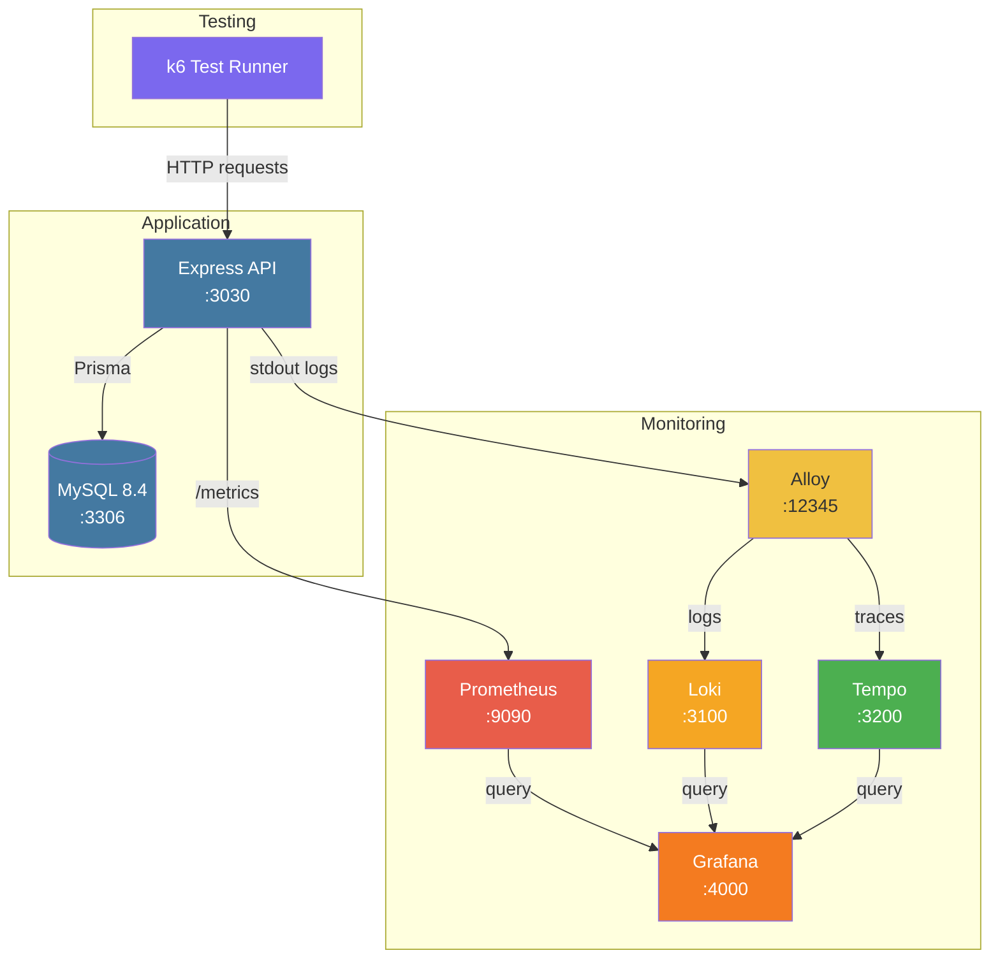

# Belajar TypeScript RESTful API

RESTful API dengan TypeScript + Express + Prisma + MySQL, dilengkapi monitoring stack (Prometheus, Grafana, Loki, Tempo, Alloy) dan k6 load/performance testing.

## Tech Stack

| Komponen | Teknologi |
|----------|-----------|
| Runtime | Node.js + TypeScript |
| Framework | Express.js |
| ORM | Prisma (mysql adapter) |
| Database | MySQL 8.4 |
| Validation | Zod |
| Logging | Winston |
| Auth | JWT (Bearer) + UUID refresh token (`X-API-TOKEN` fallback) |
| Metrics | prom-client + Prometheus |
| Monitoring | Grafana, Loki, Tempo, Alloy |
| Testing | Jest + Supertest (unit/integration), k6 (load/functional) |

## Arsitektur



## Quick Start

### Prerequisites

- Node.js 20+
- MySQL 8.4 (atau via Docker: `docker compose up -d mysql`)
- npm

### Local Development

```bash
# 1. Copy environment file
cp .env.example .env
# Sesuaikan DATABASE_URL jika perlu

# 2. Install dependencies
npm install

# 3. Setup database
npx prisma migrate dev
npx prisma generate

# 4. Build & run
npm run build
npm run start
```

Akses di http://localhost:3030

### Development Mode (Live Reload)

Untuk development tanpa compile ulang, jalankan dengan `ts-node` atau `tsx`:

```bash
npx tsx watch src/main.ts
```

### Menambah Endpoint Baru (Developer Workflow)

1. **Buat validasi** di `src/validations/` (Zod schema untuk request body/params)
2. **Buat service** di `src/services/` (business logic, call Prisma)
3. **Buat controller** di `src/controllers/` (parse request, call service, send response)
4. **Daftarkan route** di `routes/public-api.ts` (tanpa auth) atau `routes/api.ts` (dengan auth)
5. **Tambah test** di `test/api/` (Jest + Supertest)
6. **Update docs** di `docs/apis/` jika endpoint baru

### Prisma Migration Workflow

```bash
# Buat migration baru setelah ubah schema
npx prisma migrate dev --name deskripsi_perubahan

# Apply migration di production
npx prisma migrate deploy

# Reset database (development only — hapus semua data)
npx prisma migrate reset --force

# Lihat status migration
npx prisma migrate status
```

### Docker (Full Stack)

```bash
# Start semua service (MySQL + API + Monitoring)
docker compose up -d

# Start termasuk k6 test (pilih salah satu)
docker compose --profile k6 run --rm k6-load-test
docker compose --profile k6 run --rm k6-error-test
docker compose --profile k6 run --rm k6-functional-test
```

## API Endpoints

> Semua endpoint menggunakan prefix `/api/v1/`

### Public (tanpa auth)

| Method | Endpoint | Deskripsi |
|--------|----------|-----------|
| GET | `/api/v1/healthz` | Liveness probe (returns `OK`) |
| GET | `/api/v1/health` | Health check + DB connectivity |
| GET | `/api/v1/metrics` | Prometheus metrics |
| POST | `/api/v1/users` | Register user |
| POST | `/api/v1/users/login` | Login user → `{access_token, refresh_token}` |
| POST | `/api/v1/users/refresh` | Refresh JWT menggunakan `refresh_token` |

### Authenticated (`Authorization: Bearer <jwt>` atau `X-API-TOKEN`)

| Method | Endpoint | Deskripsi |
|--------|----------|-----------|
| GET | `/api/v1/users/current` | Get current user |
| PATCH | `/api/v1/users/current` | Update current user |
| DELETE | `/api/v1/users/current` | Logout |
| POST | `/api/v1/contacts` | Create contact |
| GET | `/api/v1/contacts/:id` | Get contact |
| PUT | `/api/v1/contacts/:id` | Update contact |
| DELETE | `/api/v1/contacts/:id` | Delete contact |
| GET | `/api/v1/contacts` | Search contacts (query: name, email, phone, page, size) |
| POST | `/api/v1/contacts/:id/addresses` | Create address |
| GET | `/api/v1/contacts/:id/addresses/:aid` | Get address |
| PUT | `/api/v1/contacts/:id/addresses/:aid` | Update address |
| DELETE | `/api/v1/contacts/:id/addresses/:aid` | Delete address |
| GET | `/api/v1/contacts/:id/addresses` | List addresses (pagination via `?page=&size=`) |

> Detail API spec: [docs/apis/user.md](docs/apis/user.md), [docs/apis/contact.md](docs/apis/contact.md), [docs/apis/address.md](docs/apis/address.md), [docs/monitoring-stack.md](docs/monitoring-stack.md) (monitoring)

## Project Structure

```
src/
├── app/               # Infrastructure: database, logging, metrics, tracing
├── config/            # Centralized env config (Zod) + constants (HTTP codes, messages)
├── controllers/       # Route handlers (user, contact, address, monitoring)
├── errors/            # Custom error types
├── middleware/         # Auth (JWT + X-API-TOKEN), error handler, metrics, request logger
├── models/            # Request/response DTOs
├── routes/            # Express routers (public + authenticated)
├── services/          # Business logic (user, contact, address, token)
├── types/             # TypeScript type extensions (UserRequest)
└── validations/       # Zod validation schemas

config/                # Docker monitoring stack configs
├── alloy/             # Alloy OTel collector config
├── grafana/           # Grafana dashboards & datasources
├── k6/                # k6 test scripts (3 files)
├── loki/              # Loki config
├── prometheus/        # Prometheus scrape config
└── tempo/             # Tempo tracing config

docs/apis/             # API specification docs (user, contact, address)
docs/                  # Architecture, monitoring, k6, error handling docs
test/                  # Jest + Supertest integration tests (5 files, 54 test cases)
├── api/               # Endpoint integration tests
├── test-util.ts       # Shared test utilities
└── test-util.test.ts  # Utility edge case tests
```

## Testing

### Unit/Integration Tests (Jest)

Test menggunakan Jest + Supertest. Menjalankan integration test langsung ke Express app (tanpa perlu server running).

```bash
# Run semua test (54 test cases)
npm test

# Run dengan coverage report
npm run test:coverage

# Run test file spesifik
npx jest test/api/user.test.ts
npx jest test/api/contact.test.ts

# Run dengan filter test name
npx jest -t "should return 200"
```

**5 test files — 54 test cases:**

| File | Tests | Yang Diuji |
|------|-------|-----------|
| `test/api/user.test.ts` | **19** | Register, login (JWT), refresh token, get (JWT + X-API-TOKEN), update, logout |
| `test/api/contact.test.ts` | **14** | CRUD + search + pagination |
| `test/api/address.test.ts` | **15** | CRUD + list dengan pagination |
| `test/api/monitoring.test.ts` | **3** | healthz, health, metrics |
| `test/test-util.test.ts` | **3** | Error handling edge cases |

### Test Environment

Test menggunakan database MySQL yang sama dengan development (`DATABASE_URL` dari `.env`).
Setiap test suite melakukan reset database via `prisma migrate reset --force` untuk memastikan isolasi.

### k6 Load & Performance Tests

| Test | Command | VUs | Threshold | Tujuan |
|------|---------|-----|-----------|--------|
| Load Test | `docker compose --profile k6 run --rm k6-load-test` | 20 (ramp) | p95 < 500ms | Performa di beban normal |
| Error Test | `docker compose --profile k6 run --rm k6-error-test` | 1 | p95 < 1000ms | Validasi error handling |
| Functional | `docker compose --profile k6 run --rm k6-functional-test` | 200 | p95 < 1000ms | Semua endpoint + skenario |

> Detail dokumentasi k6: [docs/k6/load-test.md](docs/k6/load-test.md), [docs/k6/functional-test.md](docs/k6/functional-test.md)

## Monitoring & Observability

| Service | URL | Kredensial |
|---------|-----|------------|
| Grafana | http://localhost:4000 | admin / admin |
| Prometheus | http://localhost:9090 | - |
| Loki | http://localhost:3100 | - |
| Tempo | http://localhost:3200 | - |
| Alloy | http://localhost:12345 | - |

> Detail monitoring: [docs/monitoring-stack.md](docs/monitoring-stack.md)

## Scripts

| Command | Deskripsi |
|---------|-----------|
| `npm run build` | Compile TypeScript ke `dist/` |
| `npm run start` | Run compiled app (port 3030 — host:3030, container:3000) |
| `npm test` | Run Jest integration tests (54 test cases) |
