# System Architecture — `belajar-typescript-restful-api`

Blueprint menyeluruh arsitektur, alur data, komponen, dan observability stack.

## Project Overview

**RESTful Contact Management API** — TypeScript + Express + Prisma + MySQL dengan full observability stack (Prometheus, Grafana, Loki, Tempo, Alloy) dan load testing (k6).

| Layer | Technology |
|-------|-----------|
| Runtime | Node.js 20 (TypeScript 5.3) |
| Framework | Express 4.18 |
| Database | MySQL 8.4 via Prisma ORM 5.10 |
| Auth | JWT (access token) + UUID (refresh token) |
| Validation | Zod 3.22 |
| Logging | Winston 3.11 + daily-rotate-file |
| Metrics | prom-client (Prometheus text format) |
| Tracing | OpenTelemetry SDK → OTLP |
| Container | Docker multi-stage build |
| Observability | Prometheus + Grafana + Loki + Tempo + Alloy |
| Load Test | k6 (functional, error, load scenarios) |

---

## 1. High-Level System Architecture

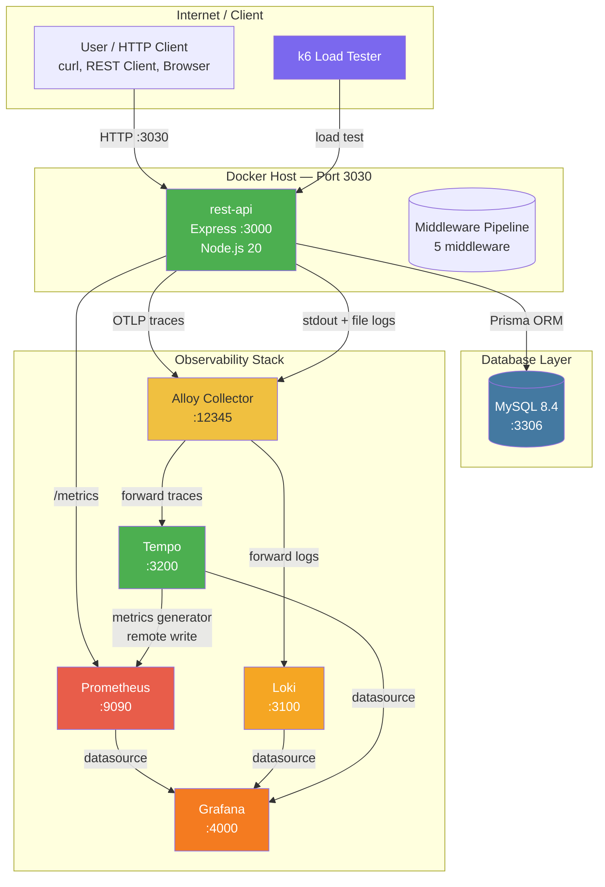

---

## 2. Application Initialization Sequence

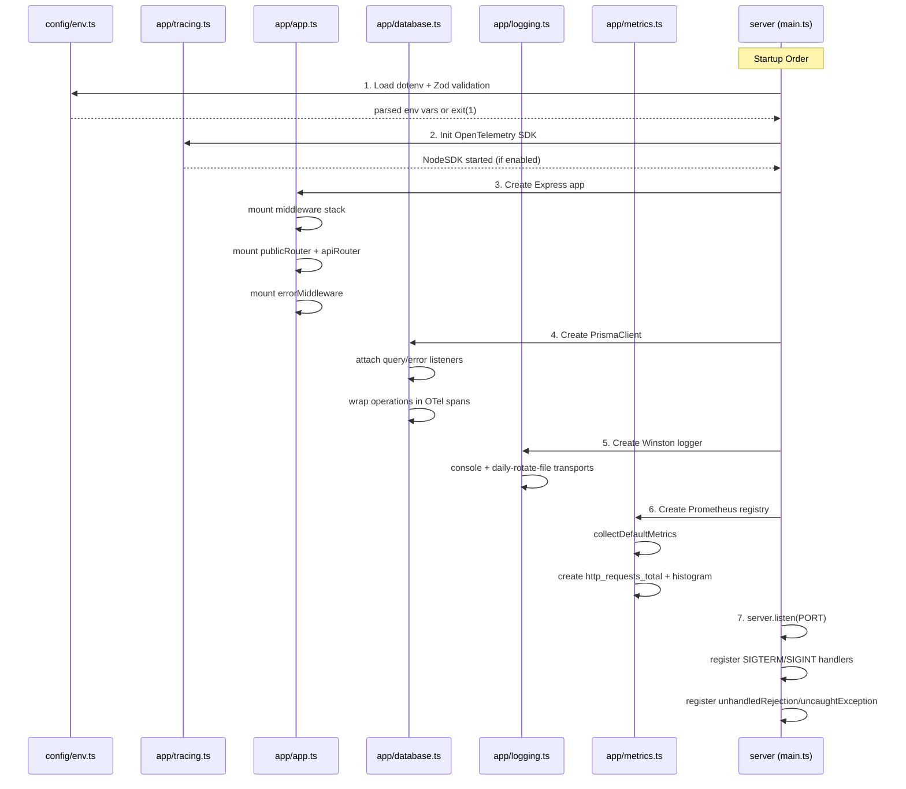

---

## 3. HTTP Request Lifecycle

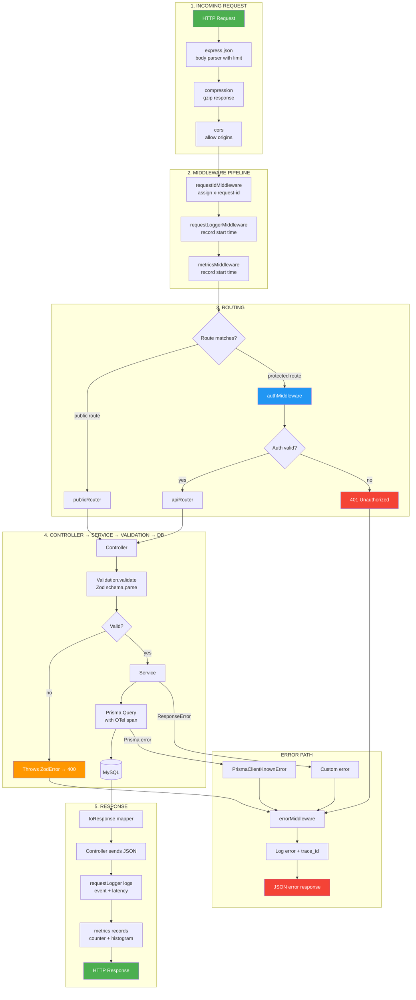

---

## 4. Authentication Flow

```mermaid
flowchart TB
    REQ[Incoming Request<br/>to protected route] --> H{Has Authorization<br/>Bearer header?}

    H -->|YES| JWT[Extract token<br/>after Bearer ]
    JWT --> VER[TokenService.verifyAccessToken<br/>jwt.verify with secret]
    VER --> OK{JWT valid?}

    OK -->|YES| LOOKUP[prismaClient.user.findUnique<br/>by username from JWT payload]
    LOOKUP --> FOUND{User exists?}
    FOUND -->|YES| SET[req.user = user<br/>next()]
    FOUND -->|NO| 401A[401 Unauthorized]

    OK -->|NO| 401A

    H -->|NO| XAPI{Has X-API-TOKEN<br/>header?}

    XAPI -->|YES| DBB[prismaClient.user.findFirst<br/>where token = x-api-token]
    DBB --> USER{User found?}
    USER -->|YES| SET
    USER -->|NO| 401A

    XAPI -->|NO| 401A

    SET --> HANDLER[Route handler executes]

    style JWT fill:#2196f3,color:#fff
    style 401A fill:#f44336,color:#fff
    style SET fill:#4caf50,color:#fff
```

---

## 5. Error Handling Decision Tree

```mermaid
flowchart TB
    ERR[Error thrown<br/>anywhere in pipeline] --> LOG[logger.error<br/>request_id + trace_id + stack]
    LOG --> TYPE{Error type?}

    TYPE -->|ZodError| ZOD[Response 400]
    ZOD --> ZRES[{errors: [{path, message}]}]

    TYPE -->|ResponseError<br/>custom status| CUST[Response custom status]
    CUST --> CRES[{errors: [{message}]}]

    TYPE -->|Prisma.PrismaClientKnownRequestError| PRISMA{Error code?}
    PRISMA -->|P2002<br/>unique constraint| P2002[Response 409]
    P2002 --> P2RES[{errors: [{message: Resource already exists}]}]
    PRISMA -->|P2025<br/>record not found| P2025[Response 404]
    P2025 --> P5RES[{errors: [{message: Resource not found}]}]
    PRISMA -->|other| PDEF[Response 400]
    PDEF --> PDRES[{errors: [{message: Database request error}]}]

    TYPE -->|Generic Error| GEN{Node environment?}
    GEN -->|production| G500[Response 500]
    G500 --> GRES[{errors: [{message: Internal server error}]}]
    GEN -->|development| GDEV[Response 500]
    GDEV --> GDRES[{errors: [{message: actual error message}]}]

    style LOG fill:#ff9800,color:#fff
    style ZOD fill:#ff9800,color:#fff
    style CUST fill:#2196f3,color:#fff
    style P2002 fill:#f44336,color:#fff
    style P2025 fill:#f44336,color:#fff
    style G500 fill:#f44336,color:#fff
```

---

## 6. API Endpoints & Data Flow

### Public Routes (No Auth Required)

```mermaid
flowchart LR
    subgraph Monitoring
        HZ["GET /api/v1/healthz"] -->|"200 OK"| HZR[returns plain text OK]
        H["GET /api/v1/health"] -->|"200 healthy"| HR[{status: healthy}]
        H -->|"503 unhealthy"| HR2[{status: unhealthy, errors}]
        M["GET /api/v1/metrics"] -->|"200"| MR[Prometheus text format metrics]
    end

    subgraph Auth
        REG["POST /api/v1/users<br/>register"] -->|"201"| REGR[{data: {username, name}}]
        REG -->|"400"| REGE[{errors: username exists}]
        LOG["POST /api/v1/users/login"] -->|"200"| LOGR[{data: {access_token, refresh_token}}]
        LOG -->|"401"| LOGE[{errors: wrong credentials}]
        REF["POST /api/v1/users/refresh"] -->|"200"| REFR[{data: new tokens}]
        REF -->|"401"| REFE[{errors: invalid refresh token}]
    end
```

### Protected Routes (Auth Required)

```mermaid
flowchart LR
    subgraph User
        GU["GET /api/v1/users/current"] -->|"200"| GUR[{data: {username, name}}]
        UU["PATCH /api/v1/users/current"] -->|"200"| UUR[{data: updated profile}]
        LU["DELETE /api/v1/users/current"] -->|"200"| LUR[{data: OK}]
    end

    subgraph Contact
        CC["POST /api/v1/contacts"] -->|"201"| CCR[{data: contact}]
        GC["GET /api/v1/contacts/:id"] -->|"200"| GCR[{data: contact}]
        UC["PUT /api/v1/contacts/:id"] -->|"200"| UCR[{data: updated contact}]
        DC["DELETE /api/v1/contacts/:id"] -->|"200"| DCR[{data: OK}]
        SC["GET /api/v1/contacts<br/>?name=&email=&page=&size="] -->|"200"| SCR[{data: [...], paging: {...}}]
    end

    subgraph Address
        CA["POST /api/v1/contacts/:id/addresses"] -->|"201"| CAR[{data: address}]
        GA["GET /api/v1/contacts/:id/addresses/:aid"] -->|"200"| GAR[{data: address}]
        UA["PUT /api/v1/contacts/:id/addresses/:aid"] -->|"200"| UAR[{data: updated address}]
        DA["DELETE /api/v1/contacts/:id/addresses/:aid"] -->|"200"| DAR[{data: OK}]
        LA["GET /api/v1/contacts/:id/addresses"] -->|"200"| LAR[{data: [...], paging: {...}}]
    end
```

---

## 7. Database Schema & Relationships

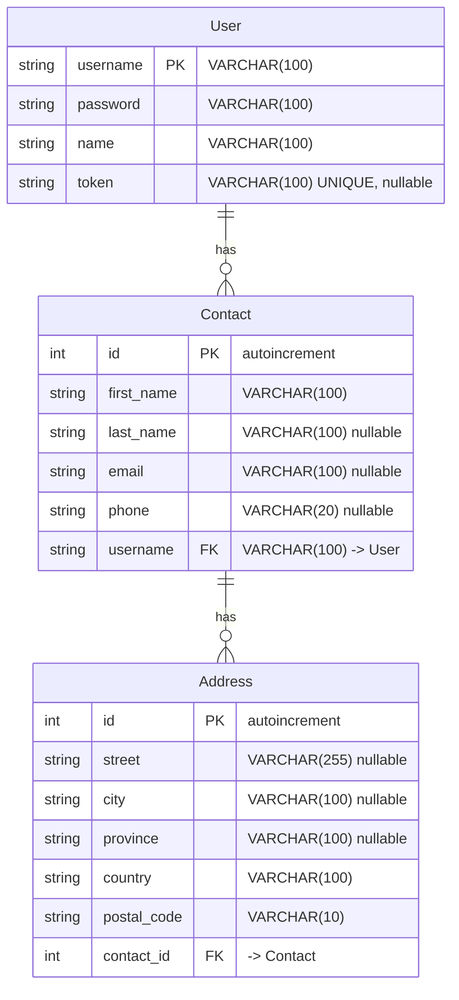

---

## 8. Middleware Pipeline (Detail)

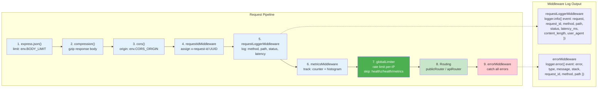

**Middleware Behavior Notes:**

- **`metricsMiddleware`** memiliki guard khusus untuk path `/metrics`: jika request mengarah ke `/api/v1/metrics`, middleware akan langsung `next()` tanpa mencatat metrik. Ini mencegah rekursi — endpoint `/metrics` sendiri tidak dihitung sebagai request.
- **`globalLimiter`** di-skip untuk endpoint `/healthz`, `/health`, `/metrics` karena dipanggil oleh Docker healthcheck dan Prometheus scrape secara otomatis. Lihat [docs/rate-limiting.md](docs/rate-limiting.md) untuk detail.

---

## 9. Docker Infrastructure

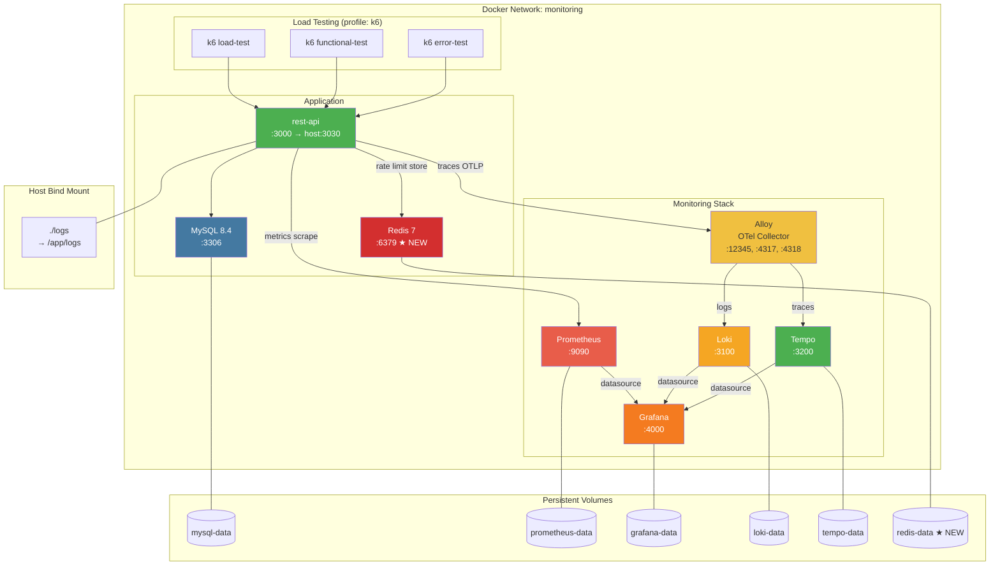

---

## 10. Observability Data Flow

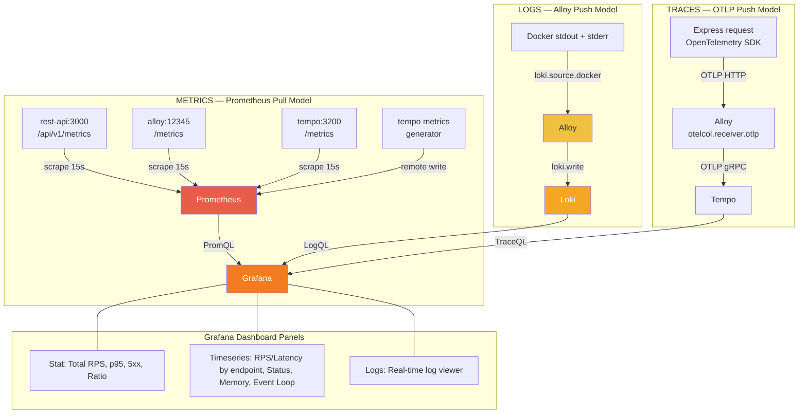

---

## 11. Logging Architecture

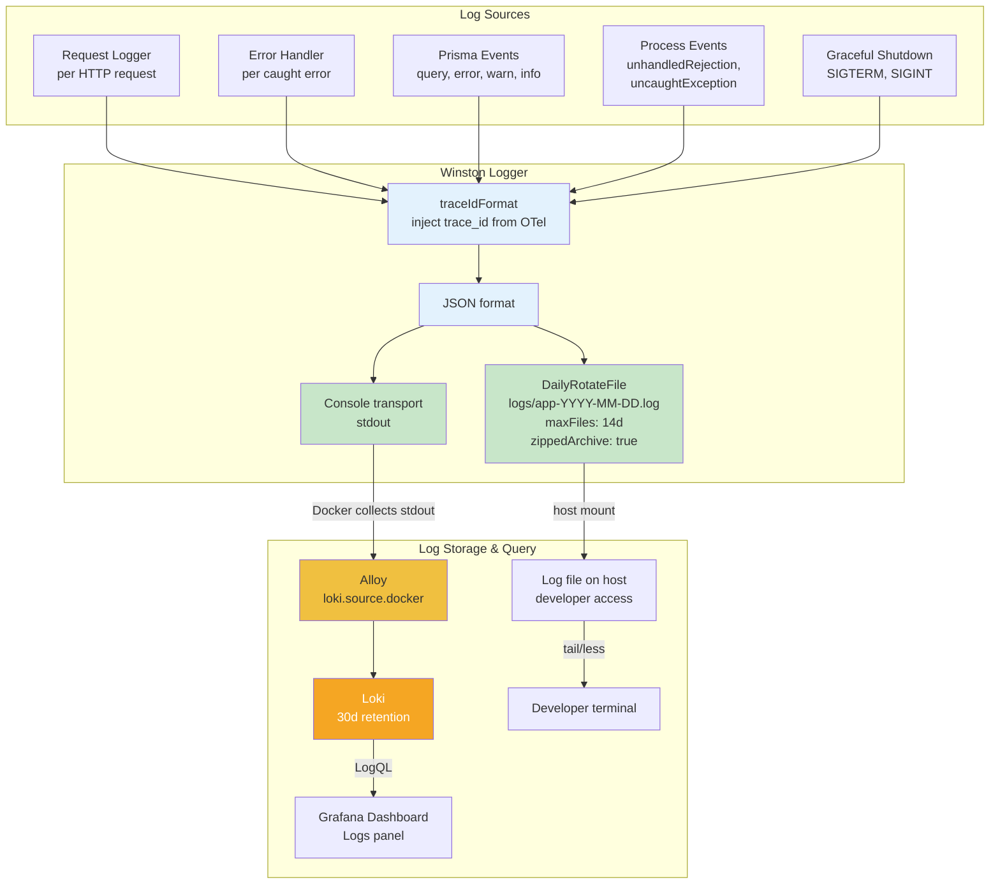

### Prisma Event Logging

PrismaClient dikonfigurasi dengan 4 level event logging yang semuanya menggunakan `emit: "event"` (tidak langsung ke stdout) dan di-forward ke Winston logger:

| Level | Winston Level | Payload |
|-------|--------------|---------|
| `error` | `logger.error()` | `{ event, message, target }` |
| `warn` | `logger.warn()` | `{ event, message, target }` |
| `info` | `logger.info()` | `{ event, message, target }` |
| `query` | `logger.debug()` | `{ event, query, duration }` |

Query log dicatat di level `debug` agar tidak mencemari log produksi, namun tetap tersedia untuk profiling query lambat.

Source: `src/app/database.ts`

---

## 12. Build Pipeline

```mermaid
flowchart LR
    subgraph "Builder Stage"
        B1[FROM node:20-alpine] --> B2[Install openssl]
        B2 --> B3[COPY package*.json]
        B3 --> B4[npm ci]
        B4 --> B5[COPY all source]
        B5 --> B6[npx prisma generate]
        B6 --> B7[npm run build<br/>tsc]
    end

    subgraph "Runner Stage"
        R1[FROM node:20-alpine] --> R2[Install openssl]
        R2 --> R3[COPY ./dist from builder]
        R3 --> R4[COPY ./node_modules from builder]
        R4 --> R5[COPY ./prisma from builder]
        R5 --> R6[COPY docker-entrypoint.sh]
        R6 --> R7[EXPOSE 3000]
        R7 --> R8[CMD: entrypoint.sh]
    end

    subgraph "Entrypoint"
        E1[npx prisma migrate deploy] --> E2[exec node dist/main.js]
    end

    B7 --> R1
    R8 --> E1
```

---

## 13. Source Code Structure

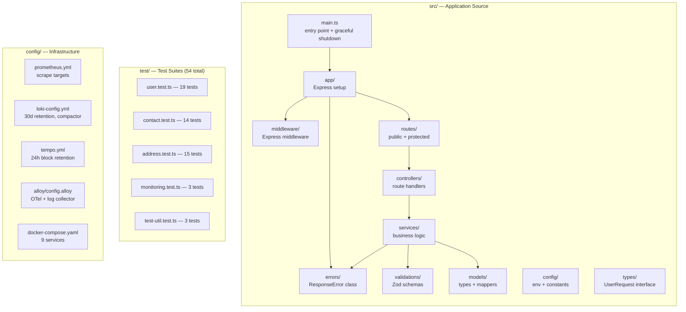

---

## 14. Port Mapping

| Service | Host Port | Container Port | Protocol | Purpose |
|---------|-----------|----------------|----------|---------|
| Express API | **3030** | 3000 | HTTP | API endpoints |
| MySQL | **3306** | 3306 | TCP | Database |
| Redis | **6379** | 6379 | TCP | Rate limit store, cache |
| Prometheus | **9090** | 9090 | HTTP | Metrics UI + API |
| Grafana | **4000** | 3000 | HTTP | Dashboard UI |
| Loki | **3100** | 3100 | HTTP | Log storage API |
| Tempo | **3200** | 3200 | HTTP | Tracing UI + API |
| Alloy | **12345** | 12345 | HTTP | Collector admin |
| Alloy | — | 4317 | gRPC | OTLP trace receiver |
| Alloy | — | 4318 | HTTP | OTLP trace receiver |

---

## 15. Environment Variables

| Variable | Default | Purpose |
|----------|---------|---------|
| `NODE_ENV` | `development` | Environment mode |
| `PORT` | `3030` | HTTP listen port |
| `DATABASE_URL` | `mysql://root:@localhost:3306/...` | MySQL connection |
| `LOG_LEVEL` | `debug` | Winston log level |
| `LOG_DIR` | `logs` | Log file directory |
| `LOG_MAX_FILES` | `14d` | Log retention period |
| `BODY_LIMIT` | `1mb` | Max request body size |
| `CORS_ORIGIN` | `*` | CORS allowed origins |
| `JWT_SECRET` | — | JWT signing secret |
| `JWT_ACCESS_EXPIRES_IN` | `15m` | Access token TTL |
| `JWT_REFRESH_EXPIRES_IN` | `7d` | Refresh token TTL |
| `OTEL_EXPORTER_OTLP_ENDPOINT` | `http://localhost:4318` | Trace export endpoint |
| `OTEL_SERVICE_NAME` | `typescript-restful-api` | Trace service name |
| `OTEL_SDK_DISABLED` | — | Set `true` to disable tracing |
| `APP_NAME` | `belajar-typescript-restful-api` | Redis key prefix — cegah bentrok |
| `REDIS_URL` | — | Redis connection URL |
| `RATE_LIMIT_ENABLED` | `true` | Master switch rate limiter |
| `RATE_LIMIT_GLOBAL_MAX` | `60` | Max request per-IP per menit (global) |
| `RATE_LIMIT_AUTH_MAX` | `20` | Max login attempt per-IP per 15 menit |
| `RATE_LIMIT_API_MAX` | `500` | Max API call per-user per 15 menit |

---

## 16. Complete Endpoint Inventory

| Method | Path | Auth | Controller | Validation | Response |
|--------|------|------|-----------|------------|----------|
| `GET` | `/api/v1/healthz` | — | `Monitoring.liveness` | — | `200 "OK"` |
| `GET` | `/api/v1/health` | — | `Monitoring.health` | — | `200 {status}` / `503 {status, errors}` |
| `GET` | `/api/v1/metrics` | — | `Monitoring.metrics` | — | `200 Prometheus text` |
| `POST` | `/api/v1/users` | — | `User.register` | `REGISTER` | `201 {data}` / `400 {errors}` / `429` |
| `POST` | `/api/v1/users/login` | — | `User.login` | `LOGIN` | `200 {data: tokens}` / `401` / `429` |
| `POST` | `/api/v1/users/refresh` | — | `User.refresh` | `REFRESH` | `200 {data: tokens}` / `401` / `429` |
| `GET` | `/api/v1/users/current` | JWT/X-API | `User.get` | — | `200 {data}` / `401` / `429` |
| `PATCH` | `/api/v1/users/current` | JWT/X-API | `User.update` | `UPDATE` | `200 {data}` / `400` / `401` / `429` |
| `DELETE` | `/api/v1/users/current` | JWT/X-API | `User.logout` | — | `200 {data: "OK"}` / `401` / `429` |
| `POST` | `/api/v1/contacts` | JWT/X-API | `Contact.create` | `CREATE` | `201 {data}` / `400` / `401` / `429` |
| `GET` | `/api/v1/contacts/:id` | JWT/X-API | `Contact.get` | — | `200 {data}` / `404` / `401` / `429` |
| `PUT` | `/api/v1/contacts/:id` | JWT/X-API | `Contact.update` | `UPDATE` | `200 {data}` / `400` / `404` / `401` / `429` |
| `DELETE` | `/api/v1/contacts/:id` | JWT/X-API | `Contact.remove` | — | `200 {data: "OK"}` / `404` / `401` / `429` |
| `GET` | `/api/v1/contacts` | JWT/X-API | `Contact.search` | `SEARCH` | `200 {data[], paging}` / `401` / `429` |
| `POST` | `/api/v1/contacts/:id/addresses` | JWT/X-API | `Address.create` | `CREATE` | `201 {data}` / `400` / `404` / `401` / `429` |
| `GET` | `/api/v1/contacts/:id/addresses/:aid` | JWT/X-API | `Address.get` | `GET` | `200 {data}` / `404` / `401` / `429` |
| `PUT` | `/api/v1/contacts/:id/addresses/:aid` | JWT/X-API | `Address.update` | `UPDATE` | `200 {data}` / `400` / `404` / `401` / `429` |
| `DELETE` | `/api/v1/contacts/:id/addresses/:aid` | JWT/X-API | `Address.remove` | `REMOVE` | `200 {data: "OK"}` / `404` / `401` / `429` |
| `GET` | `/api/v1/contacts/:id/addresses` | JWT/X-API | `Address.list` | — | `200 {data[], paging}` / `404` / `401` / `429` |

> **Note:** Route params `:id` and `:aid` only accept numeric values (`(\d+)` regex constraint). Non-numeric values produce 404.

---

## 17. Error Response Matrix

| Status | Condition | Response Body |
|--------|-----------|---------------|
| `200` | Success | `{ data: ... }` |
| `201` | Created | `{ data: ... }` |
| `400` | Zod validation failed | `{ errors: [{ path, message }] }` |
| `400` | Business logic (duplicate user) | `{ errors: [{ message }] }` |
| `401` | Missing or invalid auth | `{ errors: [{ message: "Unauthorized" }] }` |
| `401` | Wrong credentials | `{ errors: [{ message: "Username or password is wrong" }] }` |
| `401` | Invalid refresh token | `{ errors: [{ message: "Invalid refresh token" }] }` |
| `404` | Resource not found | `{ errors: [{ message }] }` |
| `409` | Unique constraint violation | `{ errors: [{ message: "Resource already exists" }] }` |
| `429` | Rate limit exceeded (global) | `{ errors: [{ message: "Too many requests, please try again later" }] }` |
| `429` | Rate limit exceeded (auth) | `{ errors: [{ message: "Too many login attempts, please try again later" }] }` |
| `429` | Rate limit exceeded (api) | `{ errors: [{ message: "Too many requests, please slow down" }] }` |
| `500` | Unknown error (production) | `{ errors: [{ message: "Internal server error" }] }` |
| `500` | Unknown error (development) | `{ errors: [{ message: error.message }] }` |
| `503` | DB unreachable (health check) | `{ status: "unhealthy", errors: [{ message }] }` |

---

## 18. Grafana Dashboard Panel Reference

| # | Panel | Type | Source | Query |
|---|-------|------|--------|-------|
| 1 | Total RPS | Stat | Prometheus | `sum(rate(http_requests_total[1m]))` |
| 2 | Global p95 Latency | Stat | Prometheus | `histogram_quantile(0.95, ...)` |
| 3 | 5xx Error RPS | Stat | Prometheus | `sum(rate(http_requests_total{status=~"5.."}[1m]))` |
| 4 | 5xx Error Ratio | Stat | Prometheus | `5xx / total` with clamp_min |
| 5 | RPS by Endpoint | Timeseries | Prometheus | `sum by(route, method)(rate(...))` |
| 6 | p95 Latency by Endpoint | Timeseries | Prometheus | `histogram_quantile` per route |
| 7 | Average Latency (ms) | Timeseries | Prometheus | `rate(sum) / rate(count) * 1000` |
| 8 | RPS by Status | Timeseries | Prometheus | `sum by(status)(rate(...))` |
| 9 | 4xx/5xx RPS by Endpoint | Timeseries | Prometheus | `sum by(route, method, status)(...)` |
| 10 | Node.js Memory | Timeseries | Prometheus | `process_resident_memory_bytes{job=~"$job"}` |
| 11 | Event Loop Lag | Timeseries | Prometheus | `nodejs_eventloop_lag_mean_seconds` + `p99` |
| 12 | Logs | Logs | Loki | `{service="typescript-restful-api"} \| json` |

Dashboard URL: `http://localhost:4000/d/typescript-rest-api-monitoring/`  
Refresh: 5s | Time range: last 15 minutes  
Datasources: Prometheus (default), Loki, Tempo

---

## 19. Rate Limiting Architecture

### 3-Tier Redis-Based Rate Limiter

| Tier | Key Basis | Window | Default Max | Target Endpoints |
|------|-----------|--------|-------------|-----------------|
| **Global** | IP address | 1 menit | 60 | Semua endpoint (kecuali health/metrics) |
| **Auth** | IP address | 15 menit | 20 | `POST /users`, `/users/login`, `/users/refresh` |
| **API** | Username (JWT) | 15 menit | 500 | Semua authenticated routes |

### Tech Stack

| Komponen | Package | Fungsi |
|----------|---------|--------|
| Rate limiter middleware | `express-rate-limit` ^7.5 | Sliding window untuk Express |
| Redis store | `rate-limit-redis` ^4.2 | Shared state antar instance |
| Redis client | `ioredis` ^5.7 | Koneksi Redis |

### Middleware Pipeline (Updated)

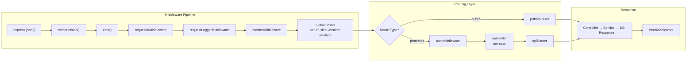

### Redis Key Namespace

Key menggunakan prefix `{APP_NAME}:ratelimit:{tier}:` untuk mencegah bentrok:

```
belajar-typescript-restful-api:ratelimit:global:192.168.1.100
belajar-typescript-restful-api:ratelimit:auth:10.0.0.55
belajar-typescript-restful-api:ratelimit:api:eko
```

### Rate Limit Response (HTTP 429)

Semua response 429 mengikuti format error yang konsisten:

```json
{
  "errors": [{"message": "Too many login attempts, please try again later"}]
}
```

Serta menyertakan `X-RateLimit-Limit`, `X-RateLimit-Remaining`, `X-RateLimit-Reset`, dan `Retry-After` headers.

### Konfigurasi

Semua nilai dapat diatur via environment variable. `RATE_LIMIT_ENABLED=false` akan menonaktifkan semua rate limiter tanpa menghapus middleware.

Detail lengkap: [docs/rate-limiting.md](docs/rate-limiting.md)
