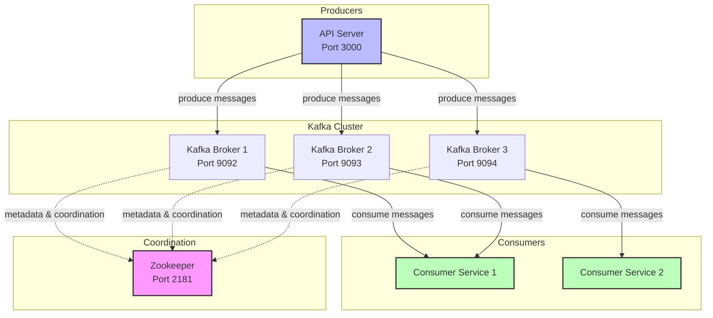
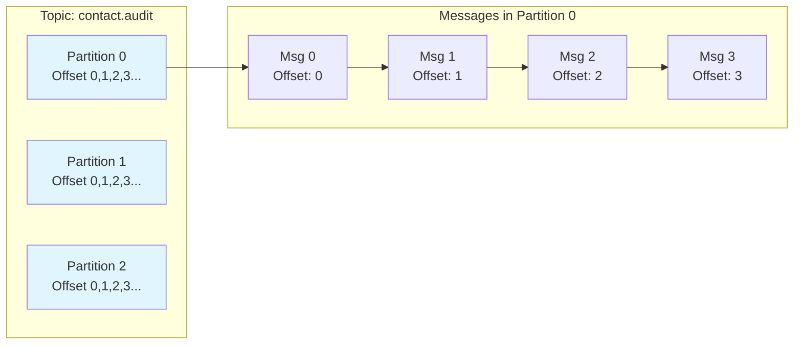
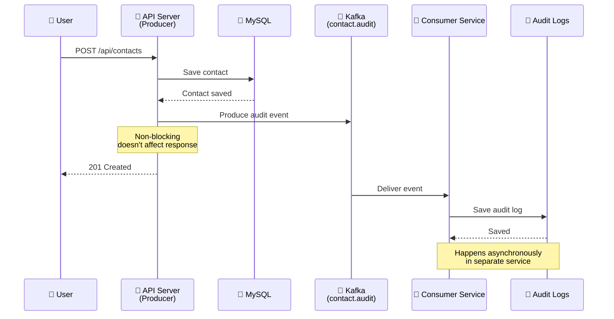

# Kafka Guide - From Zero to Hero

## 📚 Table of Contents

1. [Introduction](#introduction)
2. [Kafka Fundamentals](#kafka-fundamentals)
3. [Core Concepts with Analogies](#core-concepts-with-analogies)
4. [Kafka Architecture](#kafka-architecture)
5. [Kafka in This Application](#kafka-in-this-application)
6. [Zookeeper](#zookeeper)
7. [Message Flow](#message-flow)
8. [Components Breakdown](#components-breakdown)
9. [Configuration](#configuration)
10. [Common Operations](#common-operations)
11. [Troubleshooting](#troubleshooting)

---

## Introduction

**Apache Kafka** adalah distributed event streaming platform yang digunakan untuk high-performance data pipelines, streaming analytics, dan event-driven architectures.

Dalam aplikasi ini, Kafka digunakan untuk **audit logging** - setiap perubahan data (create, update, delete) dikirim ke Kafka sebagai event, lalu diproses oleh consumer service yang terpisah.

---

## Kafka Fundamentals

### What is Kafka?

Kafka adalah seperti **sistem penyiaran TV** yang punya banyak channel:

```
┌─────────────────────────────────────────────────────────────┐
│                     KAFKA CLUSTER                            │
│  ┌────────────┐  ┌────────────┐  ┌────────────┐           │
│  │  Channel 1 │  │  Channel 2 │  │  Channel 3 │  ...      │
│  │   (Topic)  │  │   (Topic)  │  │   (Topic)  │           │
│  └────────────┘  └────────────┘  └────────────┘           │
└─────────────────────────────────────────────────────────────┘
       ▲                ▲                ▲
       │                │                │
    Broadcaster     Broadcaster     Broadcaster
    (Producer)      (Producer)      (Producer)
```

### Key Characteristics

| Characteristic | Description |
|----------------|-------------|
| **Distributed** | Runs on a cluster of servers |
| **Scalable** | Handle millions of messages per second |
| **Fault-tolerant** | Data is replicated across brokers |
| **Fast** | O(1) performance with constant time operations |
| **Durable** | Messages persisted to disk |

---

## Core Concepts with Analogies

### 🎯 The "Red Thread" - TV Channel Analogy

| Kafka Concept | TV Channel Analogy | Real-World Example |
|----------------|-------------------|--------------------|
| **Cluster** | TV Station Building | Multiple servers working together |
| **Broker** | Studio Manager | Individual Kafka server |
| **Topic** | TV Channel | `contact.audit`, `address.audit` |
| **Partition** | Channel Frequency | Divisions for parallel processing |
| **Producer** | TV Broadcaster | API Server sending events |
| **Consumer** | TV Viewer | Consumer Service processing events |
| **Consumer Group** | Watching Party | Multiple consumers sharing load |
| **Offset** | Episode Number | Position in the message stream |
| **Message** | TV Show Episode | Audit event data |

---

## Kafka Architecture

### High-Level Architecture



### Topic Partition Structure



---

## Kafka in This Application

### Application Architecture



### Event Types Produced

| API Endpoint | Event Type | Topic | Example |
|--------------|-----------|-------|---------|
| `POST /api/contacts` | `contact.created` | `contact.audit` | New contact created |
| `PUT /api/contacts/:id` | `contact.updated` | `contact.audit` | Contact details changed |
| `DELETE /api/contacts/:id` | `contact.deleted` | `contact.audit` | Contact removed |
| `POST /api/contacts/:id/addresses` | `address.created` | `address.audit` | New address added |
| `PUT /api/contacts/:id/addresses/:addrId` | `address.updated` | `address.audit` | Address details changed |
| `DELETE /api/contacts/:id/addresses/:addrId` | `address.deleted` | `address.audit` | Address removed |

---

## Zookeeper

### What is Zookeeper?

Zookeeper adalah **koordinator** untuk Kafka cluster. Ia mengelola:
- Broker configuration
- Topic configuration
- Consumer group coordination
- Leader election for partitions

### Zookeeper-Kafka Interaction

```mermaid
graph TB
    subgraph "Zookeeper Responsibilities"
        ZC[Broker Configuration]
        ZT[Topic Configuration]
        ZG[Consumer Group Coordination]
        ZL[Leader Election]
    end

    subgraph "Kafka Brokers"
        B1[Broker 1]
        B2[Broker 2]
        B3[Broker 3]
    end

    ZK[Zookeeper] -.->ZC
    ZK -.->ZT
    ZK -.->ZG
    ZK -.->ZL

    B1<->ZK
    B2<->ZK
    B3<->ZK

    style ZK fill:#f9f,stroke:#333,stroke-width:3px
```

> **Note:** Kafka KRaft mode (Kafka Raft) is replacing Zookeeper in newer versions, but this project still uses Zookeeper.

---

## Message Flow

### Message Format

Setiap message yang dikirim ke Kafka memiliki struktur berikut:

```typescript
interface AuditEvent {
  type: string;           // Event type: "contact.created", "contact.updated", etc.
  entityType: string;     // Entity type: "contact" or "address"
  entityId: number;       // ID of the entity
  username: string;       // User who performed the action
  timestamp?: number;     // Unix timestamp (optional)
  oldValue?: any;         // Previous state (for update/delete)
  newValue?: any;         // New state (for create/update)
}
```

### Example Messages

**Contact Created:**
```json
{
  "type": "contact.created",
  "entityType": "contact",
  "entityId": 1402,
  "username": "testuser",
  "timestamp": 1776141778150,
  "newValue": {
    "id": 1402,
    "first_name": "Kafka",
    "last_name": "Success",
    "email": "kafka@test.com",
    "phone": "777777"
  }
}
```

**Contact Updated:**
```json
{
  "type": "contact.updated",
  "entityType": "contact",
  "entityId": 1402,
  "username": "testuser",
  "timestamp": 1776141800000,
  "oldValue": {
    "first_name": "Kafka",
    "last_name": "Success"
  },
  "newValue": {
    "first_name": "Kafka",
    "last_name": "Updated"
  }
}
```

**Contact Deleted:**
```json
{
  "type": "contact.deleted",
  "entityType": "contact",
  "entityId": 1402,
  "username": "testuser",
  "timestamp": 1776141850000,
  "oldValue": {
    "id": 1402,
    "first_name": "Kafka",
    "last_name": "Updated"
  }
}
```

---

## Components Breakdown

### Kafka Client Configuration

**File:** `src/application/kafka.ts`

```typescript
import { Kafka } from "kafkajs";

const kafkaBrokers = process.env.KAFKA_BROKERS || "localhost:9093";

export const kafka = new Kafka({
  clientId: "contact-api",              // Identifies this application
  brokers: kafkaBrokers.split(","),       // Kafka broker addresses
  logLevel: process.env.NODE_ENV === "development" ? 2 : 0,
});

export const kafkaTopics = {
  CONTACT_AUDIT: "contact.audit",
  ADDRESS_AUDIT: "address.audit",
} as const;
```

### Producer Implementation

**File:** `src/producer/contact-producer.ts`

```typescript
import { Producer, Partitioners } from "kafkajs";
import { kafka, kafkaTopics } from "../application/kafka";

export class ContactProducer {
  private producer: Producer;
  private isConnected: boolean = false;

  constructor() {
    this.producer = kafka.producer({
      createPartitioner: Partitioners.DefaultPartitioner,
    });
  }

  async start(): Promise<void> {
    if (this.isConnected) return;

    await this.producer.connect();
    this.isConnected = true;
    logger.info("Kafka Producer connected");
  }

  async publishAuditEvent(event: AuditEvent): Promise<void> {
    if (!this.isConnected) {
      logger.warn("Producer not connected, skipping event publish");
      return;
    }

    const topic = event.entityType === "contact"
      ? kafkaTopics.CONTACT_AUDIT
      : kafkaTopics.ADDRESS_AUDIT;

    await this.producer.send({
      topic,
      messages: [{
        key: event.username,        // Partition by username
        value: JSON.stringify(event),
      }],
    });
  }

  async shutdown(): Promise<void> {
    if (!this.isConnected) return;

    await this.producer.disconnect();
    this.isConnected = false;
    logger.info("Kafka Producer disconnected");
  }
}

// Singleton instance
export const contactProducer = new ContactProducer();
```

### Consumer Implementation

**File:** `src/consumer/audit-consumer.ts`

```typescript
import { Consumer } from "kafkajs";
import { kafka, kafkaTopics } from "../application/kafka";
import { prismaClient } from "../application/database";

export class AuditConsumer {
  private consumer: Consumer;
  private isRunning: boolean = false;

  constructor(groupId: string = "audit-service") {
    this.consumer = kafka.consumer({ groupId });
  }

  async start(): Promise<void> {
    if (this.isRunning) return;

    await this.consumer.connect();
    await this.consumer.subscribe({
      topics: [kafkaTopics.CONTACT_AUDIT, kafkaTopics.ADDRESS_AUDIT],
      fromBeginning: false,  // Only new messages
    });

    await this.consumer.run({
      eachMessage: async ({ topic, partition, message }) => {
        try {
          const event: AuditEvent = JSON.parse(message.value!.toString());

          // Save to database
          await prismaClient.auditLog.create({
            data: {
              eventType: event.type,
              entityType: event.entityType,
              entityId: event.entityId,
              username: event.username,
              timestamp: new Date(event.timestamp || Date.now()),
              oldValue: event.oldValue,
              newValue: event.newValue,
            },
          });

          logger.debug(`Audit event processed: ${event.type}`);
        } catch (error) {
          logger.error(`Failed to process message: ${error}`);
          // Don't throw - continue processing
        }
      },
    });

    this.isRunning = true;
    logger.info("Audit consumer started");
  }

  async shutdown(): Promise<void> {
    if (!this.isRunning) return;

    await this.consumer.stop();    // Stop consuming
    await this.consumer.disconnect(); // Disconnect
    this.isRunning = false;
    logger.info("Audit consumer stopped");
  }

  isActive(): boolean {
    return this.isRunning;
  }
}
```

### Producer Usage in Services

**File:** `src/service/contact-service.ts`

```typescript
import { contactProducer } from "../producer/contact-producer";

export class ContactService {
  async create(request: CreateContactRequest, username: string): Promise<Contact> {
    // 1. Save to database
    const contact = await prismaClient.contact.create({...});

    // 2. Produce audit event (non-blocking)
    const auditEvent: AuditEvent = {
      type: "contact.created",
      entityType: "contact",
      entityId: contact.id,
      username: username,
      newValue: contact,
    };

    // Fire and forget - doesn't affect API response
    contactProducer.publishAuditEvent(auditEvent).catch(err =>
      logger.error(`Failed to publish audit event: ${err}`)
    );

    // 3. Return response (audit happens in background)
    return contact;
  }
}
```

---

## Configuration

### Environment Variables

| Variable | Description | Default | Example |
|----------|-------------|---------|---------|
| `KAFKA_BROKERS` | Comma-separated broker addresses | `localhost:9093` | `172.26.21.88:9093` |

### Docker Compose Configuration

```yaml
services:
  zookeeper:
    image: confluentinc/cp-zookeeper:7.5.0
    ports:
      - "2181:2181"
    environment:
      ZOOKEEPER_CLIENT_PORT: 2181

  kafka:
    image: confluentinc/cp-kafka:7.5.0
    ports:
      - "9093:9093"    # External access
      - "9092:9092"    # Internal Docker
    environment:
      KAFKA_BROKER_ID: 1
      KAFKA_ZOOKEEPER_CONNECT: zookeeper:2181
      KAFKA_ADVERTISED_LISTENERS: PLAINTEXT_HOST://kafka:9092,PLAINTEXT://172.26.21.88:9093
      KAFKA_INTER_BROKER_LISTENER_NAME: PLAINTEXT_HOST

  kafka-ui:
    image: provectuslabs/kafka-ui:latest
    ports:
      - "8080:8080"
    environment:
      KAFKA_CLUSTERS_0_BOOTSTRAPSERVERS: kafka:9092
```

---

## Common Operations

### CLI Commands Reference

| Operation | Command | Description |
|-----------|---------|-------------|
| **List Topics** | `kafka-topics.sh --bootstrap-server localhost:9093 --list` | Show all topics |
| **Create Topic** | `kafka-topics.sh --bootstrap-server localhost:9093 --create --topic test` | Create new topic |
| **Describe Topic** | `kafka-topics.sh --bootstrap-server localhost:9093 --describe --topic contact.audit` | Show topic details |
| **Consumer Groups** | `kafka-consumer-groups.sh --bootstrap-server localhost:9093 --list` | List consumer groups |
| **Describe Group** | `kafka-consumer-groups.sh --bootstrap-server localhost:9093 --describe --group audit-service` | Show group details |
| **Read Messages** | `kafka-console-consumer.sh --bootstrap-server localhost:9093 --topic contact.audit --from-beginning` | Consume from CLI |

### Kafka UI

Access **Kafka UI** at: http://localhost:8080

Features:
- View topics and partitions
- Browse messages
- Monitor consumer groups
- Check consumer lag

---

## Troubleshooting

### Common Issues

| Issue | Symptom | Solution |
|-------|----------|----------|
| **EADDRINUSE** | "Port already in use" | Kill orphaned processes: `pkill -f "ts-node"` |
| **EAI_AGAIN** | "getaddrinfo EAI_AGAIN kafka" | Wrong broker address - check KAFKA_BROKERS |
| **Connection Timeout** | Producer can't connect | Verify Kafka is running: `docker-compose ps kafka` |
| **No messages received** | Consumer not getting messages | Check consumer group, topic subscription |

### Consumer Lag

Consumer lag = difference between log end offset and current offset.

```bash
# Check consumer lag
kafka-consumer-groups.sh --bootstrap-server localhost:9093 \
  --describe --group audit-service
```

**Output:**
```
TOPIC           PARTITION  CURRENT-OFFSET  LOG-END-OFFSET  LAG
contact.audit   0          100             105             5
```

### Health Check

Use the health endpoint to check all components:

```bash
curl http://localhost:3000/health
```

**Response:**
```json
{
  "status": "healthy",
  "checks": {
    "database": { "status": "up", "latency": 5 },
    "redis": { "status": "up", "latency": 2 },
    "kafka": { "status": "up" }
  }
}
```

---

## Quick Reference

### Key Files

| File | Purpose |
|------|---------|
| `src/application/kafka.ts` | Kafka client configuration |
| `src/producer/contact-producer.ts` | Producer implementation |
| `src/consumer/audit-consumer.ts` | Consumer implementation |
| `src/consumer-server.ts` | Consumer service entry point |
| `src/main.ts` | API server entry point (producer) |

### Startup Commands

```bash
# Terminal 1: API Server (Producer)
npm run dev

# Terminal 2: Consumer Service
npm run dev:consumer

# Production
npm start              # API Server
npm run start:consumer  # Consumer Service
```

### Topics

| Topic | Purpose | Partitions |
|-------|---------|------------|
| `contact.audit` | Contact CRUD events | 1 (auto-created) |
| `address.audit` | Address CRUD events | 1 (auto-created) |

### Consumer Groups

| Group ID | Purpose | From Beginning? |
|----------|---------|-----------------|
| `audit-service` | Audit log processing | No (latest only) |

---

**Last Updated:** 2026-04-14
