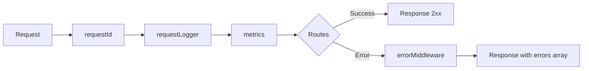
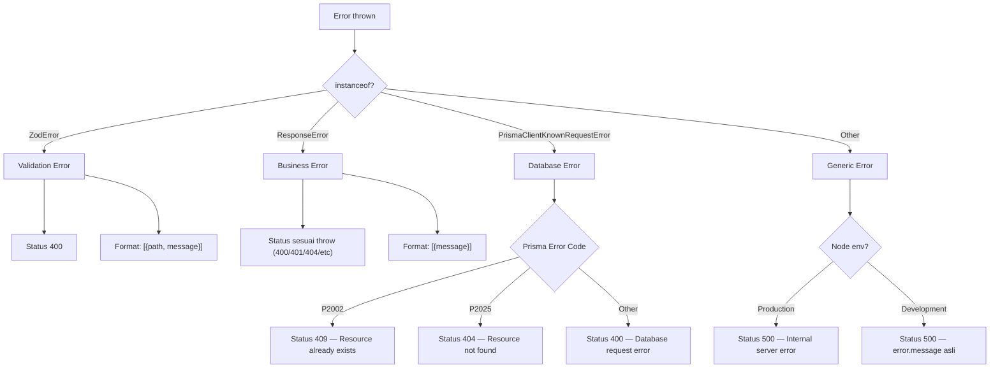
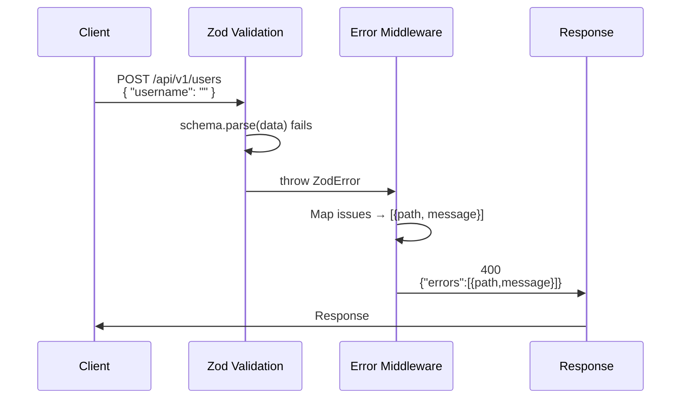
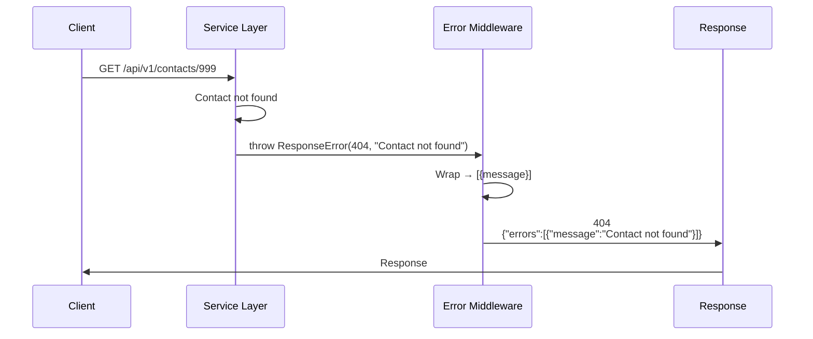
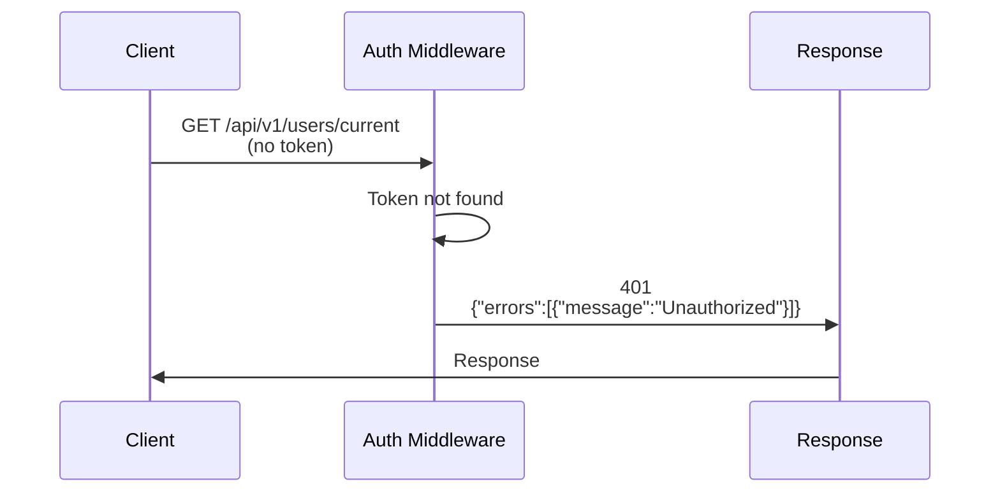
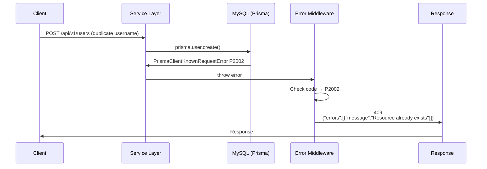
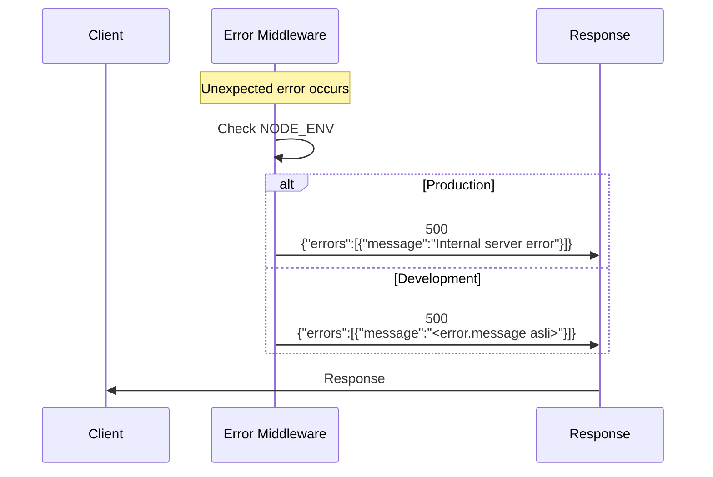

# Error Handling

Semua error response menggunakan format **array of objects** yang konsisten di seluruh endpoint.

---

## Middleware Pipeline



---

## Error Decision Tree



---

## Format Dasar

```json
{
  "errors": [
    { "message": "Pesan error..." }
  ]
}
```

Untuk **validation error**, ditambahkan field `path` yang menunjuk field spesifik:

```json
{
  "errors": [
    { "path": "email", "message": "Invalid email" },
    { "path": "password", "message": "String must contain at least 1 character(s)" }
  ]
}
```

---

## Flow Per Skenario

### 1. Validation Error (Zod)



**Request:**
```http
POST /api/v1/users
Content-Type: application/json

{
  "username": "",
  "password": "",
  "name": ""
}
```

**Response (400):**
```json
{
  "errors": [
    { "path": "username", "message": "String must contain at least 1 character(s)" },
    { "path": "password", "message": "Required" },
    { "path": "name", "message": "Required" }
  ]
}
```

---

### 2. Business Error (ResponseError)



**Request:**
```http
GET /api/v1/contacts/99999
Authorization: Bearer <jwt>
```

**Response (404):**
```json
{
  "errors": [
    { "message": "Contact not found" }
  ]
}
```

---

### 3. Unauthorized (Auth Middleware)



**Request:**
```http
GET /api/v1/users/current
```

**Response (401):**
```json
{
  "errors": [
    { "message": "Unauthorized" }
  ]
}
```

---

### 4. Database Error (Prisma)



**Request:**
```http
POST /api/v1/users
Content-Type: application/json

{
  "username": "eko",
  "password": "eko123",
  "name": "Eko"
}
```

**Response (409):**
```json
{
  "errors": [
    { "message": "Resource already exists" }
  ]
}
```

---

### 5. Generic 500 (Development vs Production)



**Response — Production (500):**
```json
{
  "errors": [
    { "message": "Internal server error" }
  ]
}
```

**Response — Development (500):**
```json
{
  "errors": [
    { "message": "Cannot read property 'x' of undefined" }
  ]
}
```

---

## Daftar Error per Tipe

| Tipe | Status Code | Format | Field `path` | Contoh |
|------|-------------|--------|-------------|--------|
| **Validation (ZodError)** | `400` | `[{path, message}]` | ✅ Ada | `{"path":"email","message":"Invalid email"}` |
| **Business (ResponseError)** | Custom (400/401/404) | `[{message}]` | ❌ Tidak | `{"message":"Contact not found"}` |
| **DB Unique (Prisma P2002)** | `409` | `[{message}]` | ❌ Tidak | `{"message":"Resource already exists"}` |
| **DB Not Found (Prisma P2025)** | `404` | `[{message}]` | ❌ Tidak | `{"message":"Resource not found"}` |
| **DB Generic (Prisma other)** | `400` | `[{message}]` | ❌ Tidak | `{"message":"Database request error"}` |
| **Unauthorized (Auth)** | `401` | `[{message}]` | ❌ Tidak | `{"message":"Unauthorized"}` |
| **Internal Server Error** | `500` | `[{message}]` | ❌ Tidak | `{"message":"Internal server error"}` |
| **Health Check Dependency** | `503` | `[{message}]` | ❌ Tidak | `{"message":"dependency unavailable"}` |

---

## Sumber Error

| Sumber | File | Mekanisme |
|--------|------|-----------|
| **ZodError** | `src/validations/*.ts` | Validasi request body via `schema.parse(data)` |
| **ResponseError** | `src/errors/response-error.ts` | Business logic throw `new ResponseError(status, message)` |
| **PrismaClientKnownRequestError** | `src/middleware/error-middleware.ts` | Database operation errors (P2002, P2025) |
| **Auth Middleware** | `src/middleware/auth-middleware.ts` | JWT invalid / token tidak ditemukan |
| **Monitoring** | `src/controllers/monitoring-controller.ts` | Database unreachable saat health check |

## Catatan

- **Production**: Generic 500 error menyembunyikan detail pesan (`"Internal server error"`)
- **Development**: Generic 500 error menampilkan pesan asli (`error.message`)
- Frontend cukup melakukan `errors.map(e => e.message)` tanpa perlu mengecek tipe data
- Untuk validation error, frontend bisa pakai `errors.map(e => ({ field: e.path, msg: e.message }))` untuk mapping ke form field
