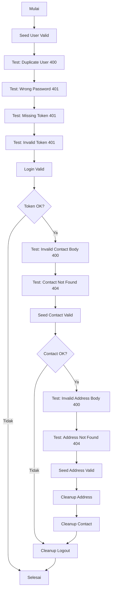
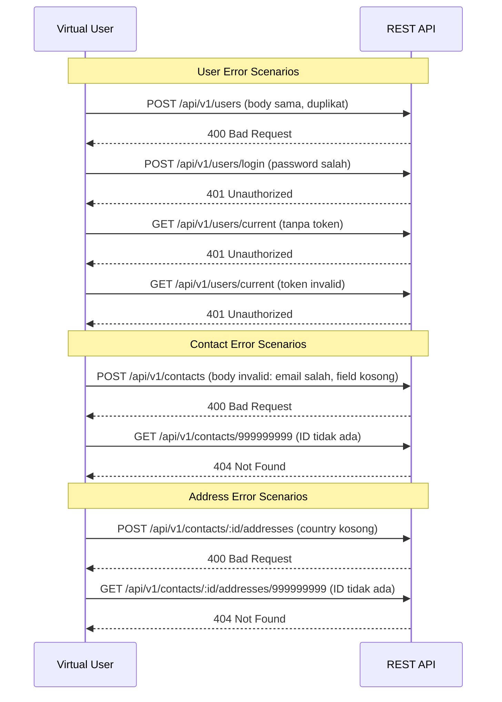

# K6 Error Test

## Penjelasan

Error test ini menguji semua skenario error handling API untuk memastikan response code, error message, dan validasi bekerja sesuai harapan. Test ini berjalan 1x saja (1 VU, 1 iterasi) karena fokusnya pada correctness, bukan performance.

**Karakteristik:**
- **Jenis:** Error Handling Test
- **VUs:** 1 Virtual User
- **Iterasi:** 1 kali saja
- **Threshold:** p95 < 1000ms, checks rate > 0.95
- **Alur:** Seed data valid, lalu uji semua skenario error, cleanup

## Diagram Skenario Error



## Diagram Error Scenarios per Endpoint



## Diagram VUs & Iterations

```mermaid
xychart-beta
    title "Virtual Users - Error Test"
    x-axis "Waktu" [0, 1]
    y-axis "VUs" 0 --> 2
    line [1, 1]
```

> Hanya 1 VU, 1 iterasi. Fokus pada correctness, bukan load.

## Skenario Error yang Diuji

| Endpoint | Method | Skenario | Expected Status |
|----------|--------|----------|-----------------|
| `/api/v1/users` | POST | Register duplikat | 400 |
| `/api/v1/users/login` | POST | Password salah | 401 |
| `/api/v1/users/current` | GET | Tanpa token | 401 |
| `/api/v1/users/current` | GET | Token invalid | 401 |
| `/api/v1/contacts` | POST | Body invalid (email salah, field kosong) | 400 |
| `/api/v1/contacts/:id` | GET | ID tidak ada (999999999) | 404 |
| `/api/v1/contacts/:id/addresses` | POST | Body invalid (country kosong) | 400 |
| `/api/v1/contacts/:id/addresses/:aid` | GET | ID tidak ada (999999999) | 404 |

## Thresholds

| Metric | Threshold | Keterangan |
|--------|-----------|------------|
| `http_req_duration` | p(95) < 1000ms | Response time wajar |
| `checks` | rate > 0.95 | 95% assertion harus pass |

## Cara Menjalankan

```bash
docker compose --profile k6 run --rm k6-error-test
```

## Contoh Output

```
     ✓ seed valid user status is 201
     ✓ duplicate user status is 400
     ✓ wrong login status is 401
     ✓ missing token status is 401
     ✓ invalid token status is 401
     ✓ valid login status is 200
     ✓ valid login has token
     ✓ invalid contact body status is 400
     ✓ contact not found status is 404
     ✓ seed contact status is 201
     ✓ seed contact has id
     ✓ invalid address body status is 400
     ✓ address not found status is 404
     ✓ seed address status is 201
     ✓ seed address has id
     ✓ cleanup address status is 200
     ✓ cleanup contact status is 200
     ✓ cleanup logout status is 200

     checks.........................: 100.00% ✓ 18
     http_req_duration..............: avg=12.5ms  p(95)=45.0ms
     iterations.....................: 1
```
