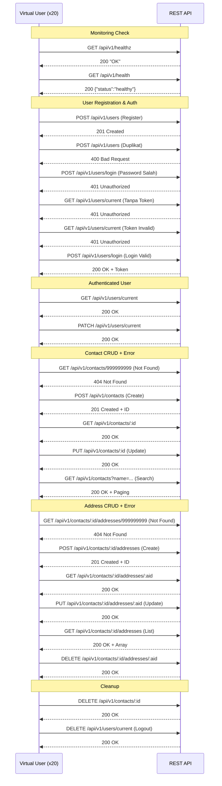
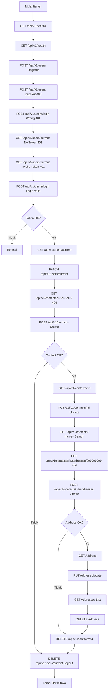

# K6 Functional Test

## Penjelasan

Functional test ini menguji **semua 23 endpoint** API secara komprehensif, mencakup baik response sukses (2xx) maupun error (4xx). Setiap iterasi menjalankan lifecycle lengkap satu user dari register sampai logout, termasuk pengujian edge case di tengah-tengah.

**Karakteristik:**
- **Jenis:** Functional / Correctness Test
- **VUs:** 200 Virtual Users
- **Iterasi:** 5000 iterasi (shared di antara 200 VUs, ~25 iterasi per VU)
- **Threshold:** p95 < 1000ms, checks rate > 0.95
- **Alur:** Full lifecycle + error scenarios di setiap iterasi

## Diagram VUs & Iterations

```mermaid
xychart-beta
    title "Virtual Users - Functional Test"
    x-axis "Waktu" [0, 1, 2, ..., 10]
    y-axis "VUs" 0 --> 220
    line [200, 200, 200, 200, 200, 200, 200, 200, 200, 200, 0]
```

> 200 VU konstan, total 5000 iterasi dibagi rata (~25 per VU). Tidak ada ramp-up/ramp-down.

## Diagram API Flow per Iteration



## Diagram Iteration Flow



## Endpoint Coverage

| # | Endpoint | Method | Skenario | Expected |
|---|----------|--------|----------|----------|
| 1 | `/api/v1/healthz` | GET | Health check simple | 200 |
| 2 | `/api/v1/health` | GET | Health check detail | 200 |
| 3 | `/api/v1/users` | POST | Register valid | 201 |
| 4 | `/api/v1/users` | POST | Register duplikat | 400 |
| 5 | `/api/v1/users/login` | POST | Password salah | 401 |
| 6 | `/api/v1/users/current` | GET | Tanpa token | 401 |
| 7 | `/api/v1/users/current` | GET | Token invalid | 401 |
| 8 | `/api/v1/users/login` | POST | Login valid | 200 |
| 9 | `/api/v1/users/current` | GET | Get profile (auth) | 200 |
| 10 | `/api/v1/users/current` | PATCH | Update profile | 200 |
| 11 | `/api/v1/contacts/:id` | GET | Contact not found | 404 |
| 12 | `/api/v1/contacts` | POST | Create contact | 201 |
| 13 | `/api/v1/contacts/:id` | GET | Get contact | 200 |
| 14 | `/api/v1/contacts/:id` | PUT | Update contact | 200 |
| 15 | `/api/v1/contacts` | GET | Search contacts | 200 |
| 16 | `/api/v1/contacts/:id/addresses/:aid` | GET | Address not found | 404 |
| 17 | `/api/v1/contacts/:id/addresses` | POST | Create address | 201 |
| 18 | `/api/v1/contacts/:id/addresses/:aid` | GET | Get address | 200 |
| 19 | `/api/v1/contacts/:id/addresses/:aid` | PUT | Update address | 200 |
| 20 | `/api/v1/contacts/:id/addresses` | GET | List addresses | 200 |
| 21 | `/api/v1/contacts/:id/addresses/:aid` | DELETE | Delete address | 200 |
| 22 | `/api/v1/contacts/:id` | DELETE | Delete contact | 200 |
| 23 | `/api/v1/users/current` | DELETE | Logout | 200 |

## Thresholds

| Metric | Threshold | Keterangan |
|--------|-----------|------------|
| `http_req_duration` | p(95) < 1000ms | Response time wajar untuk functional test |
| `checks` | rate > 0.95 | 95% assertion harus pass |

## Cara Menjalankan

```bash
docker compose --profile k6 run --rm k6-functional-test
```

## Contoh Output

```
     ✓ healthz status is 200
     ✓ healthz body is OK
     ✓ health status is 200
     ✓ health response is healthy
     ✓ register status is 201
     ✓ register returns username
     ✓ duplicate user status is 400
     ✓ wrong login status is 401
     ✓ missing token status is 401
     ✓ invalid token status is 401
     ...

     checks.........................: 97.82% ✓ 11000
     http_req_duration..............: avg=85.3ms  p(95)=420.1ms
     http_req_failed................: 0.00%
      iterations.....................: 5000
      vus............................: 200
```

---

## Error Scenarios Coverage (Subset)

Seluruh 8 skenario error juga diuji secara terpisah oleh **k6 error test** (1 VU, 1 iterasi). Detail error scenarios yang tercakup:

| Endpoint | Method | Skenario | Expected Status |
|----------|--------|----------|-----------------|
| `/api/v1/users` | POST | Register duplikat | 400 |
| `/api/v1/users/login` | POST | Password salah | 401 |
| `/api/v1/users/current` | GET | Tanpa token | 401 |
| `/api/v1/users/current` | GET | Token invalid | 401 |
| `/api/v1/contacts` | POST | Body invalid (email salah, field kosong) | 400 |
| `/api/v1/contacts/:id` | GET | ID tidak ada (999999999) | 404 |
| `/api/v1/contacts/:id/addresses` | POST | Body invalid (country kosong) | 400 |
| `/api/v1/contacts/:id/addresses/:aid` | GET | ID tidak ada (999999999) | 404 |

> Error test dapat dijalankan secara terpisah dengan: `docker compose --profile k6 run --rm k6-error-test`
> Perbedaannya: functional test menjalankan error + success dalam 1 iterasi user-siklus penuh (200 VU),
> sedangkan error test fokus murni pada skenario error (1 VU) tanpa beban. Keduanya komplementer.
