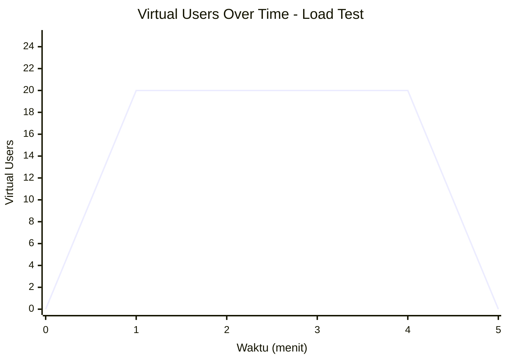
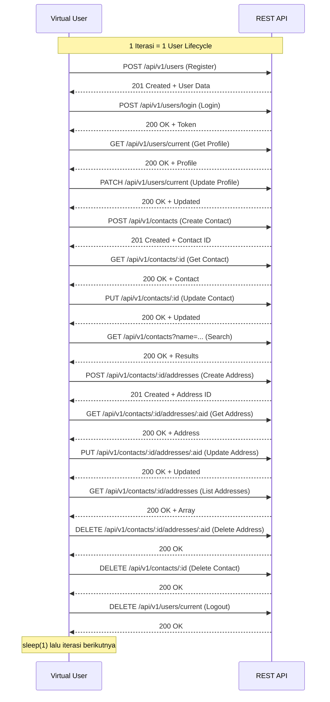
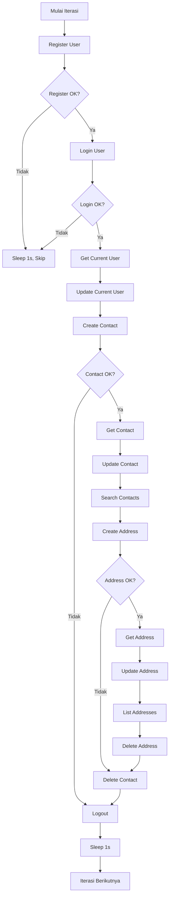

# K6 Load Test

## Penjelasan

Load test ini mensimulasikan beban normal pengguna secara bertahap untuk mengukur performa API dalam kondisi steady-state. Tujuannya adalah memastikan response time tetap di bawah threshold dan error rate terjaga.

**Karakteristik:**
- **Jenis:** Performance / Load Test
- **VUs:** Maksimal 20 Virtual Users
- **Durasi:** ~5 menit (1m ramp-up, 3m sustain, 1m ramp-down)
- **Threshold:** p95 < 500ms, error rate < 5%
- **Alur:** Happy path saja (register → login → CRUD contact → CRUD address → logout)

## Diagram VUs Over Time



## Diagram API Flow per Iteration



## Diagram Iteration Flow



## Thresholds

| Metric | Threshold | Keterangan |
|--------|-----------|------------|
| `http_req_duration` | p(95) < 500ms | 95% request harus di bawah 500ms |
| `http_req_failed` | rate < 0.05 | Error rate harus di bawah 5% |

## Cara Menjalankan

```bash
docker compose --profile k6 run --rm k6-load-test
```

## Contoh Output

```
     ✓ register status is 201
     ✓ register returns username
     ✓ login status is 200
     ✓ login has token
     ✓ current user status is 200
     ✓ current user is correct
     ...

     checks.........................: 98.45% ✓ 12345
     http_req_duration..............: avg=45.2ms  p(95)=180.3ms
     http_req_failed................: 0.02%  ✓ 5  ✗ 25000
     iterations.....................: 2500
     vus............................: 20
```
