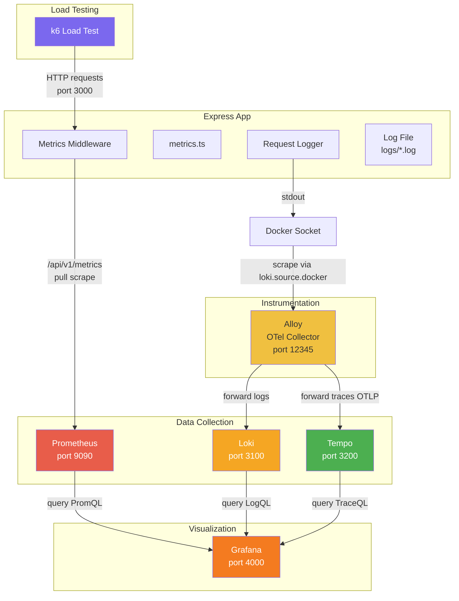
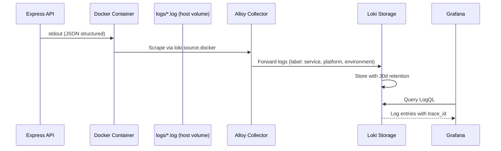
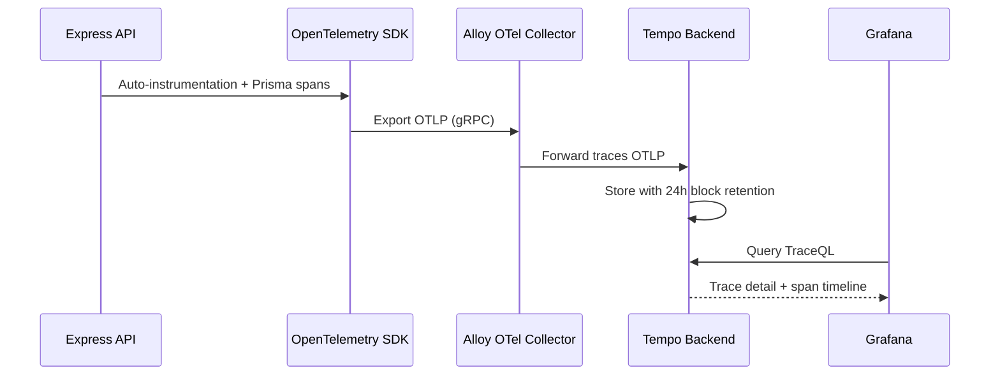
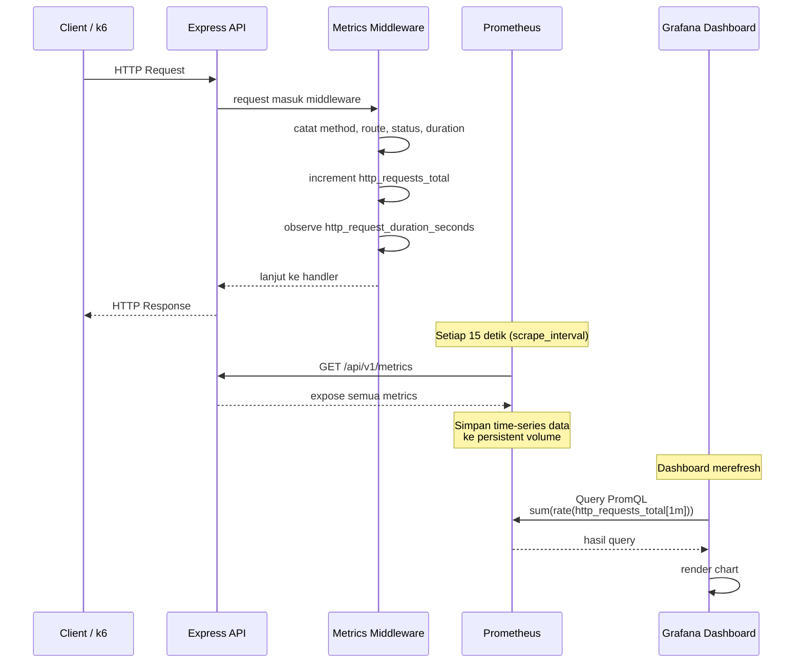
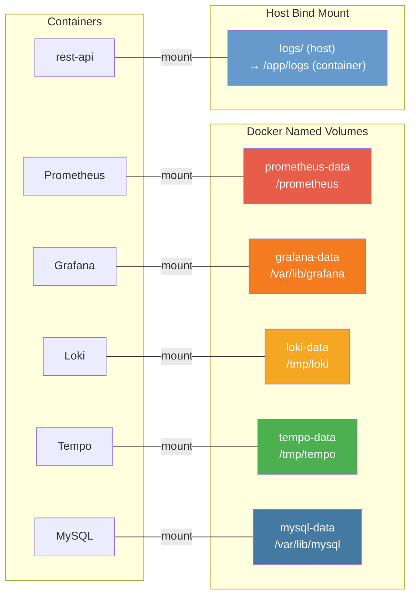

# Monitoring Stack

Dokumentasi ini menjelaskan arsitektur observability stack lengkap: metrics, logging, distributed tracing, alur data, persistent storage, dan konfigurasi retensi.

## Arsitektur Observability



### Alur Log



### Alur Traces



## Alur Data Metrics



## Sumber Data

### Metrics
| Sumber | Metric | Cara |
|--------|--------|------|
| Express Metrics Middleware | `http_requests_total`, `http_request_duration_seconds` | Prometheus scrape `/api/v1/metrics` |
| Node.js Runtime | `process_resident_memory_bytes`, `nodejs_eventloop_lag_*` | `prom-client` collectDefaultMetrics |
| Alloy | Alloy internal metrics | Prometheus scrape `alloy:12345` |
| Tempo | Tempo metrics generator | Prometheus scrape `tempo:3200/metrics` |

### Logs
| Sumber | Tujuan | Metode |
|--------|--------|--------|
| Docker stdout | Alloy → Loki | `loki.source.docker` (Docker socket) |

### Traces
| Sumber | Tujuan | Metode |
|--------|--------|--------|
| OpenTelemetry SDK | Alloy → Tempo | OTLP gRPC `alloy:4317` |

## Persistent Storage



### Detail Volume

| Service | Volume Name | Mount Path | Isi Data | Persistent |
|---------|------------|------------|----------|-----------|
| MySQL | `typescript-restful-api-mysql-data` | `/var/lib/mysql` | Database tables, user data | Ya |
| Prometheus | `prometheus-data` | `/prometheus` | Time-series metrics (15 hari retention) | Ya |
| Grafana | `grafana-data` | `/var/lib/grafana` | Dashboard config, users, annotations | Ya |
| Loki | `loki-data` | `/tmp/loki` | Log entries, indexes (30 hari retention) | Ya |
| Tempo | `tempo-data` | `/tmp/tempo` | Distributed traces (24h block retention) | Ya |
| File Logs | Host `./logs` | `/app/logs` | JSON log files (14 hari rotation) | Host bind mount |

### Service Tanpa Volume Persistent

| Service | Alasan |
|---------|--------|
| Alloy | Collector/forwarder, tidak menyimpan data sendiri |
| k6 (all profiles) | Ephemeral load test runner, tidak butuh persistence |
| rest-api | App stateless, data di MySQL |

## Sumber Data Metrics

### RPS (Requests Per Second)

```
Metric:    http_requests_total
Tipe:      Counter
Sumber:    src/middleware/metrics-middleware.ts
Query:     sum(rate(http_requests_total[1m]))
```

Setiap request masuk, counter naik dengan label `method`, `route`, `status`.

### Latency (P95, P99)

```
Metric:    http_request_duration_seconds_bucket
Tipe:      Histogram
Sumber:    src/middleware/metrics-middleware.ts
Query:     histogram_quantile(0.95, sum(rate(http_request_duration_seconds_bucket[5m])) by (le))
```

Durasi setiap request dicatat dalam histogram bucket.

### Memory & Event Loop

```
Metric:    process_resident_memory_bytes
           nodejs_eventloop_lag_mean_seconds
           nodejs_eventloop_lag_p99_seconds
Tipe:      Gauge / Summary
Sumber:    src/app/metrics.ts (collectDefaultMetrics)
```

Default metrics dari `prom-client` yang expose Node.js runtime metrics.

## Retention

| Service | Retention | Config |
|---------|----------|--------|
| Prometheus | 15 hari | `--storage.tsdb.retention.time=15d` |
| Loki | 30 hari | `compactor.retention_duration: 720h` via Loki 3.x compactor |
| Tempo | 24 jam (block) | `compactor.compaction.block_retention: 24h` |
| File logs | 14 hari | `winston-daily-rotate-file maxFiles: 14d` |

### Detail Loki Compactor

Loki 3.x menggunakan **compactor** untuk mengelola retensi, bukan `table_manager` yang sudah deprecated. Compactor menggabungkan (compact) index dan menghapus data yang melebihi retention period.

```yaml
compactor:
  working_directory: /tmp/loki/compactor
  retention_enabled: true
  delete_request_store: filesystem
  retention_duration: 720h
```

## Alloy Configuration

Alloy bertindak sebagai **OTel Collector** yang menerima traces dari aplikasi dan mengirimkannya ke Tempo, serta **Log Collector** yang mengumpulkan logs dari Docker socket dan file logs ke Loki.

### Sumber Log

| Sumber | Alloy Component | Label Tambahan |
|--------|----------------|----------------|
| Docker container stdout | `loki.source.docker` | `platform=docker`, `environment=production`, `log_source=docker` |

### Log Enrichment

Setiap log entry diberi label tambahan untuk memudahkan filtering di Grafana:
- `service` — nama container (dari Docker)
- `platform` — `docker`
- `environment` — `production`
- `log_source` — `docker`

## Grafana Dashboard

Dashboard **TypeScript REST API Monitoring** tersedia di http://localhost:4000 dengan panel:

| Panel | Type | Sumber Data | Deskripsi |
|-------|------|-------------|-----------|
| Total RPS | Stat | Prometheus | Request rate global |
| Global p95 Latency | Stat | Prometheus | Latensi p95 semua endpoint |
| 5xx Error RPS | Stat | Prometheus | Volume error rate |
| 5xx Error Ratio | Stat | Prometheus | Persentase error vs total |
| RPS by Endpoint | Timeseries | Prometheus | Request rate per route+method |
| p95 Latency by Endpoint | Timeseries | Prometheus | Latensi p95 per route+method |
| Average Latency (ms) | Timeseries | Prometheus | Rata-rata latensi |
| RPS by Status | Timeseries | Prometheus | Distribusi status code |
| 4xx/5xx RPS by Endpoint | Timeseries | Prometheus | Error per endpoint |
| Node.js Memory | Timeseries | Prometheus | RSS memory usage |
| Node.js Event Loop Lag | Timeseries | Prometheus | Event loop delay |
| **Logs** | **Logs** | **Loki** | **Real-time logs filter by service** |
| **Trace Log Correlation** | **Logs** | **Loki** | **Filter log berdasarkan trace_id** |

## Grafana Datasources

| Datasource | Type | URL | UID |
|------------|------|-----|-----|
| Prometheus | prometheus | `http://prometheus:9090` | `prometheus-ds` (default) |
| Loki | loki | `http://loki:3100` | `loki-ds` |
| Tempo | tempo | `http://tempo:3200` | `tempo-ds` |

## Cara Menjalankan

```bash
# Start semua service
docker compose up -d

# Rebuild rest-api setelah ada perubahan kode
docker compose build rest-api && docker compose up -d rest-api

# Restart Alloy setelah ada perubahan config
docker compose restart alloy

# Restart service lain setelah config change
docker compose restart loki prometheus tempo

# Jalankan k6 test (pilih salah satu)
docker compose --profile k6 run --rm k6-load-test
docker compose --profile k6 run --rm k6-error-test
docker compose --profile k6 run --rm k6-functional-test

# Cek volume
docker volume ls | grep typescript-restful-api

# Cek log di host
tail -f logs/app-*.log
```

## Port Mapping

| Service | Host Port | Container Port | URL |
|---------|----------|---------------|-----|
| Express API | 3030 | 3000 | http://localhost:3030 |
| Prometheus | 9090 | 9090 | http://localhost:9090 |
| Grafana | 4000 | 3000 | http://localhost:4000 |
| Loki | 3100 | 3100 | http://localhost:3100 |
| Tempo | 3200 | 3200 | http://localhost:3200 |
| Alloy | 12345 | 12345 | http://localhost:12345 |
| Alloy (OTLP gRPC) | 4317 | 4317 | internal |
| Alloy (OTLP HTTP) | 4318 | 4318 | internal |
| MySQL | 3306 | 3306 | localhost:3306 |

---

## Monitoring API Spec

### Liveness Probe

Endpoint : GET /api/v1/healthz

Response Status : **200 OK**

Response Body (Success) :
```
OK
```

### Health Check

Endpoint : GET /api/v1/health

Response Status : **200 OK**

Response Body (Success) :
```json
{
  "status": "healthy"
}
```

Response Body (Failed — DB Unreachable) :
```json
{
  "status": "unhealthy",
  "errors": [{"message": "dependency unavailable"}]
}
```

### Prometheus Metrics

Endpoint : GET /api/v1/metrics

Response Status : **200 OK**

Response Body (Success) :
```
# HELP http_requests_total Total number of HTTP requests
# TYPE http_requests_total counter
http_requests_total{method="GET",route="/api/v1/contacts",status="200"} 150

# HELP http_request_duration_seconds Duration of HTTP requests in seconds
# TYPE http_request_duration_seconds histogram
http_request_duration_seconds_bucket{le="0.1",method="GET",route="/api/v1/contacts",status="200"} 120
```

### Available Metrics

| Metric | Type | Deskripsi |
|--------|------|-----------|
| `http_requests_total` | Counter | Total request dengan label method, route, status |
| `http_request_duration_seconds` | Histogram | Durasi request dalam seconds |
| `process_resident_memory_bytes` | Gauge | Memori yang digunakan proses |
| `nodejs_eventloop_lag_seconds` | Summary | Event loop lag |
