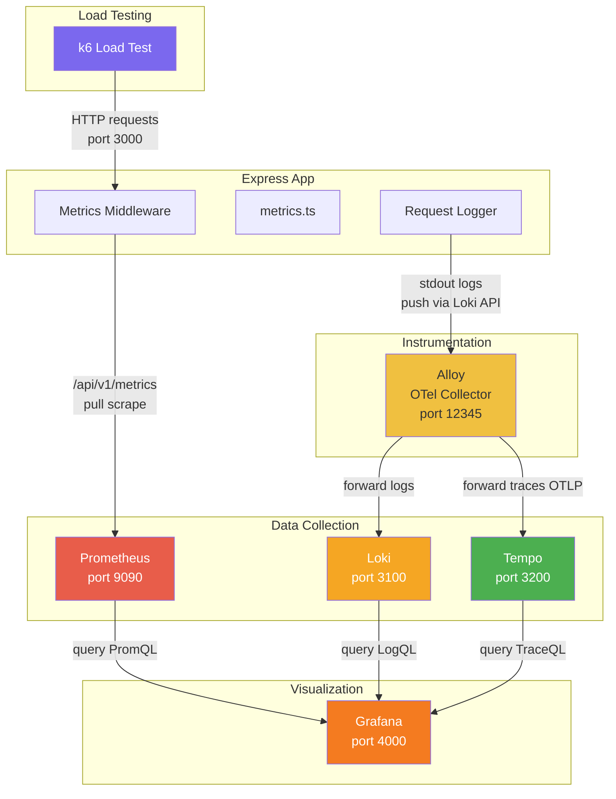
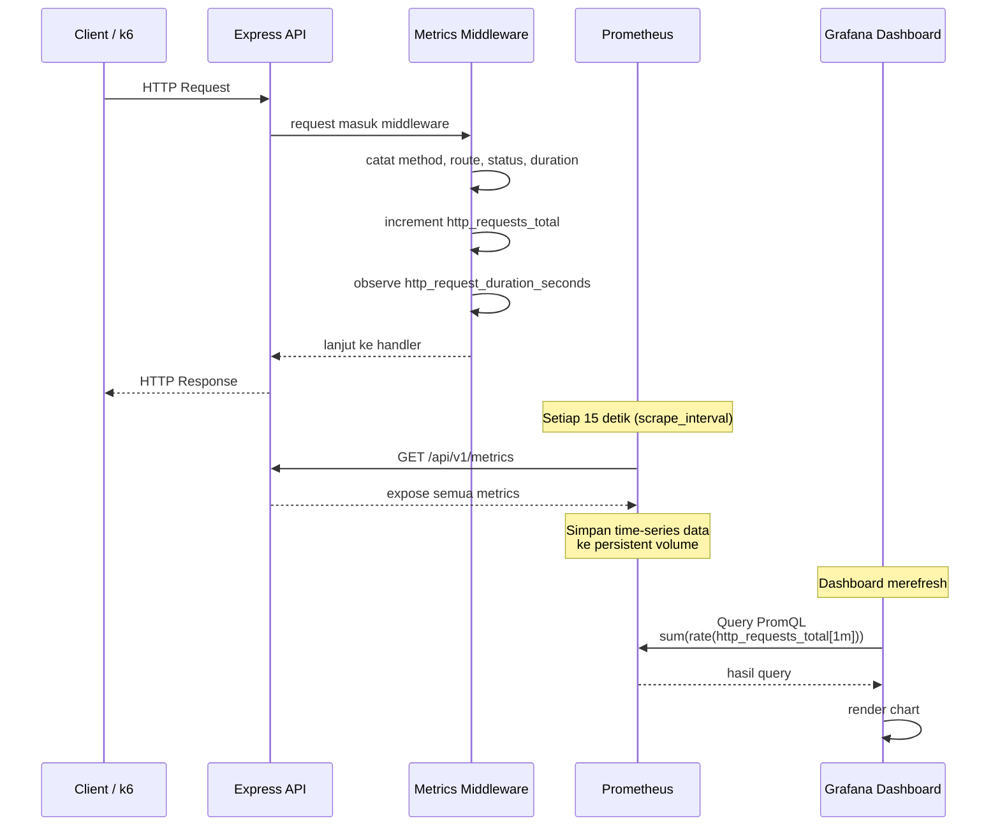
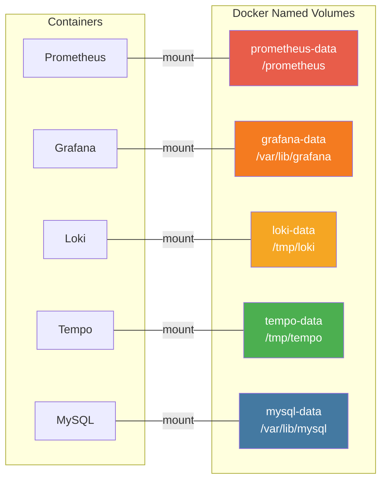

# Monitoring Stack

Dokumentasi ini menjelaskan arsitektur monitoring stack, alur data metrics, dan konfigurasi persistent storage untuk semua service.

## Arsitektur Monitoring Stack



## Alur Data Metrics



## Persistent Storage



### Detail Volume

| Service | Volume Name | Mount Path | Isi Data | Persistent |
|---------|------------|------------|----------|-----------|
| MySQL | `typescript-restful-api-mysql-data` | `/var/lib/mysql` | Database tables, user data | Ya |
| Prometheus | `prometheus-data` | `/prometheus` | Time-series metrics (15 hari retention) | Ya |
| Grafana | `grafana-data` | `/var/lib/grafana` | Dashboard config, users, annotations | Ya |
| Loki | `loki-data` | `/tmp/loki` | Log entries, indexes | Ya |
| Tempo | `tempo-data` | `/tmp/tempo` | Distributed traces | Ya |

### Service Tanpa Volume Persistent

| Service | Alasan |
|---------|--------|
| Alloy | Collector/forwarder, tidak menyimpan data sendiri |
| k6 (all profiles) | Ephemeral load test runner, tidak butuh persistence |
| rest-api | App stateless, data di MySQL |

## Sumber Data Metrics

### RPS (Requests Per Second)

```
Metric:    http_requests_total
Tipe:      Counter
Sumber:    src/middleware/metrics-middleware.ts
Query:     sum(rate(http_requests_total[1m]))
```

Setiap request masuk, counter naik dengan label `method`, `route`, `status`.

### Latency (P95, P99)

```
Metric:    http_request_duration_seconds_bucket
Tipe:      Histogram
Sumber:    src/middleware/metrics-middleware.ts
Query:     histogram_quantile(0.95, sum(rate(http_request_duration_seconds_bucket[5m])) by (le))
```

Durasi setiap request dicatat dalam histogram bucket.

### Memory & Event Loop

```
Metric:    process_resident_memory_bytes
           nodejs_eventloop_lag_mean_seconds
           nodejs_eventloop_lag_p99_seconds
Tipe:      Gauge / Summary
Sumber:    src/app/metrics.ts (collectDefaultMetrics)
```

Default metrics dari `prom-client` yang expose Node.js runtime metrics.

## Retention

| Service | Retention | Config |
|---------|----------|--------|
| Prometheus | 15 hari | `--storage.tsdb.retention.time=15d` |
| Loki | Default (bisa diubah di loki-config.yml) | `table_manager` |
| Tempo | Default (bisa diubah di tempo.yml) | `compactor` |

## Cara Menjalankan

```bash
# Start semua service
docker compose up -d

# Jalankan k6 test (pilih salah satu)
docker compose --profile k6 run --rm k6-load-test
docker compose --profile k6 run --rm k6-error-test
docker compose --profile k6 run --rm k6-functional-test

# Cek volume
docker volume ls | grep typescript-restful-api

# Cek data Prometheus
docker exec typescript-restful-api-prometheus ls -la /prometheus/
```

## Port Mapping

| Service | Host Port | Container Port | URL |
|---------|----------|---------------|-----|
| Express API | 3030 | 3000 | http://localhost:3030 |
| Prometheus | 9090 | 9090 | http://localhost:9090 |
| Grafana | 4000 | 3000 | http://localhost:4000 |
| Loki | 3100 | 3100 | http://localhost:3100 |
| Tempo | 3200 | 3200 | http://localhost:3200 |
| Alloy | 12345 | 12345 | http://localhost:12345 |
| MySQL | 3306 | 3306 | localhost:3306 |
